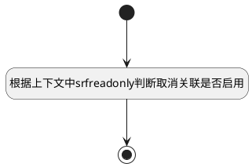

## 版本表格列行为是否启用 <!-- {docsify-ignore-all} -->

   用于动态启用列绑定的界面行为

### 处理过程




### 处理步骤说明

#### 开始 :id=Begin<sup class="footnote-symbol"> <font color=gray size=1>[开始]</font></sup>


#### 根据上下文中srfreadonly判断取消关联是否启用 :id=RAWJSCODE1<sup class="footnote-symbol"> <font color=gray size=1>[直接前台代码]</font></sup>


<p class="panel-title"><b>执行代码</b></p>

```javascript
const rows = uiLogic.grid.state.rows;
const srfreadonly = context.srfreadonly;
if (rows && rows.length > 0) {
	rows.forEach(row => {
		const actionColumn = row.uiActionGroupStates.create_time;
		if (actionColumn && Object.values(actionColumn).length > 0) {
			Object.values(actionColumn).forEach(action => {
                if(srfreadonly == true){
					// 恢复版本
					if (action.uiActionId === 'restore@version') {
                        action.disabled = true;
                    }
                    //编辑版本
					if (action.uiActionId === 'edit_version@version') {
                        action.disabled = true;
                    }
				}
			})
		}
	})
}	

```

#### 结束 :id=END1<sup class="footnote-symbol"> <font color=gray size=1>[结束]</font></sup>


### 实体逻辑参数

|    中文名   |    代码名    |  数据类型      |备注 |
| --------| --------| --------  | --------   |
|表格|Grid|当前部件对象||
|传入变量(<i class="fa fa-check"/></i>)|Default|数据对象||
