## 计算表格列行为状态（version） <!-- {docsify-ignore-all} -->

   判断版本是否与当前版本一致，是否可恢复此版本

### 处理过程

```plantuml
@startuml
hide footbox
<style>
root {
  HyperlinkColor #42b983
}
</style>

hide empty description
state "开始" as Begin <<start>> [[$./calc_column_button_state#begin {开始}]]
state "判断恢复版本是否禁用" as RAWJSCODE1  [[$./calc_column_button_state#rawjscode1 {判断恢复版本是否禁用}]]


Begin --> RAWJSCODE1


@enduml
```




### 处理步骤说明

#### 开始 :id=Begin<sup class="footnote-symbol"> <font color=gray size=1>[开始]</font></sup>


#### 判断恢复版本是否禁用 :id=RAWJSCODE1<sup class="footnote-symbol"> <font color=gray size=1>[直接前台代码]</font></sup>


<p class="panel-title"><b>执行代码</b></p>

```javascript
// 主表单中的当前版本标识
const cur_version_id = uiLogic.view.parentView.layoutPanel.panelItems.form.control.data.cur_version_id;
console.log("主表单中的当前版本标识", cur_version_id);
const rows = uiLogic.grid.state.rows;
if (rows && rows.length > 0) {
	rows.forEach(row => {
		const titleColumn = row.uiActionGroupStates.create_time;
		const version_id = row.data.id;
		if (titleColumn && Object.values(titleColumn).length > 0) {
			Object.values(titleColumn).forEach(action => {
				if (action.uiActionId === 'restore@version') {
                    // 版本标识为当前版本标识，禁用恢复版本
					action.disabled = version_id == cur_version_id;
				}
			})
		}
	})
}

```


### 实体逻辑参数

|    中文名   |    代码名    |  数据类型      |备注 |
| --------| --------| --------  | --------   |
|传入变量(<i class="fa fa-check"/></i>)|Default|数据对象||
|view|view|当前视图对象||
|当前表格|grid|当前部件对象||
