## 打开工作项主视图 <!-- {docsify-ignore-all} -->

   打开工作项主视图

### 处理过程

```plantuml
@startuml
hide footbox
<style>
root {
  HyperlinkColor #42b983
}
</style>

hide empty description
state "开始" as Begin <<start>> [[$./open_work_item_main_view#begin {开始}]]
state "打开工作项" as DEUIACTION1  [[$./open_work_item_main_view#deuiaction1 {打开工作项}]]
state "上下文" as PREPAREJSPARAM1  [[$./open_work_item_main_view#preparejsparam1 {上下文}]]
state "获取工作项" as DEACTION1  [[$./open_work_item_main_view#deaction1 {获取工作项}]]


Begin --> PREPAREJSPARAM1
PREPAREJSPARAM1 --> DEACTION1
DEACTION1 --> DEUIACTION1


@enduml
```

### 处理步骤说明

#### 开始 :id=Begin [开始]

#### 上下文 :id=PREPAREJSPARAM1 [准备参数]

1. 将`Default(传入变量).owner_id` 设置给  `ctx(应用上下文变量).work_item`
2. 将`Default(传入变量).owner_id` 设置给  `work_item(工作项).id`

#### 获取工作项 :id=DEACTION1 [实体行为]

调用实体 [工作项(WORK_ITEM)](module/ProjMgmt/work_item.md) 行为 [Get](module/ProjMgmt/work_item#行为) ，行为参数为`work_item(工作项)`

将执行结果返回给参数`work_item(工作项)`

#### 打开工作项 :id=DEUIACTION1 [实体界面行为调用]

调用实体 [版本(VERSION)](module/Base/version.md) 界面行为 [打开工作项主视图](module/Base/version#界面行为) ，行为参数为`work_item(工作项)`

### 实体逻辑参数

|    中文名   |    代码名    |  数据类型      |备注 |
| --------| --------| --------  | --------   |
|应用上下文变量|ctx|导航视图参数绑定参数||
|传入变量(<i class="fa fa-check"/></i>)|Default|数据对象||
|工作项|work_item|数据对象||
