## 触发计数器刷新 <!-- {docsify-ignore-all} -->

   关联数据变更后，触发计数器刷新

### 处理过程

```plantuml
@startuml
hide footbox
<style>
root {
  HyperlinkColor #42b983
}
</style>

hide empty description
state "开始" as Begin <<start>> [[$./refresh_counter#begin {开始}]]
state "计数器刷新" as RAWJSCODE2  [[$./refresh_counter#rawjscode2 {计数器刷新}]]
state "主表单重新加载" as VIEWCTRLINVOKE2  [[$./refresh_counter#viewctrlinvoke2 {主表单重新加载}]]
state "结束" as END1 <<end>> [[$./refresh_counter#end1 {结束}]]
state "表格显示" as RAWJSCODE3  [[$./refresh_counter#rawjscode3 {表格显示}]]
state "绑定视图部件" as PREPAREJSPARAM1  [[$./refresh_counter#preparejsparam1 {绑定视图部件}]]


Begin --> RAWJSCODE3
RAWJSCODE3 --> PREPAREJSPARAM1
PREPAREJSPARAM1 --> VIEWCTRLINVOKE2
VIEWCTRLINVOKE2 --> RAWJSCODE2
RAWJSCODE2 --> END1


@enduml
```




### 处理步骤说明

#### 开始 :id=Begin<sup class="footnote-symbol"> <font color=gray size=1>[开始]</font></sup>


#### 结束 :id=END1<sup class="footnote-symbol"> <font color=gray size=1>[结束]</font></sup>


#### 表格显示 :id=RAWJSCODE3<sup class="footnote-symbol"> <font color=gray size=1>[直接前台代码]</font></sup>


<p class="panel-title"><b>执行代码</b></p>

```javascript
view.layoutPanel.panelItems.grid.state.visible = true;

```

#### 绑定视图部件 :id=PREPAREJSPARAM1<sup class="footnote-symbol"> <font color=gray size=1>[准备参数]</font></sup>


1. 将`view(当前视图).parentView.layoutPanel.panelItems.form.control` 设置给  `form(主表单)`

#### 主表单重新加载 :id=VIEWCTRLINVOKE2<sup class="footnote-symbol"> <font color=gray size=1>[视图部件调用]</font></sup>


调用`form(主表单)`的方法`load`，参数为`Default(传入变量)`
#### 计数器刷新 :id=RAWJSCODE2<sup class="footnote-symbol"> <font color=gray size=1>[直接前台代码]</font></sup>


<p class="panel-title"><b>执行代码</b></p>

```javascript
ibiz.mc.command.update.send({ srfdecodename: context.principal_type});
```


### 实体逻辑参数

|    中文名   |    代码名    |  数据类型      |备注 |
| --------| --------| --------  | --------   |
|主表单|form|数据对象||
|当前视图|view|当前视图对象||
|传入变量(<i class="fa fa-check"/></i>)|Default|数据对象||
|表格|grid|部件对象||
