## 版本变化后刷新主表单 <!-- {docsify-ignore-all} -->

   版本变化后，触发主表单重新加载

### 处理过程

```plantuml
@startuml
hide footbox
<style>
root {
  HyperlinkColor #42b983
}
</style>

hide empty description
state "开始" as Begin <<start>> [[$./version_change_after_refresh#begin {开始}]]
state "主表单重新加载" as VIEWCTRLINVOKE1  [[$./version_change_after_refresh#viewctrlinvoke1 {主表单重新加载}]]
state "绑定主表单" as PREPAREJSPARAM1  [[$./version_change_after_refresh#preparejsparam1 {绑定主表单}]]


Begin --> PREPAREJSPARAM1
PREPAREJSPARAM1 --> VIEWCTRLINVOKE1


@enduml
```

### 处理步骤说明

#### 开始 :id=Begin [开始]

#### 绑定主表单 :id=PREPAREJSPARAM1 [准备参数]

1. 将`view(当前视图对象).parentView.layoutPanel.panelItems.form.control` 设置给  `form(主表单)`

#### 主表单重新加载 :id=VIEWCTRLINVOKE1 [视图部件调用]

调用`form(主表单)`的方法`load`，参数为`form(主表单)`

### 实体逻辑参数

|    中文名   |    代码名    |  数据类型      |备注 |
| --------| --------| --------  | --------   |
|传入变量(<i class="fa fa-check"/></i>)|Default|数据对象||
|主表单|form|部件对象||
|当前视图对象|view|当前视图对象||
