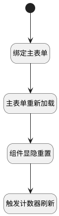

## 版本变化后刷新主表单 <!-- {docsify-ignore-all} -->

   版本变化后，触发主表单重新加载

### 处理过程


```plantuml
@startuml
hide footbox
<style>
root {
  HyperlinkColor #42b983
}
</style>

hide empty description
state "开始" as Begin <<start>> [[$./version_change_after_refresh#begin {开始}]]
state "绑定主表单" as PREPAREJSPARAM1  [[$./version_change_after_refresh#preparejsparam1 {绑定主表单}]]
state "主表单重新加载" as VIEWCTRLINVOKE1  [[$./version_change_after_refresh#viewctrlinvoke1 {主表单重新加载}]]
state "触发计数器刷新" as RAWJSCODE2  [[$./version_change_after_refresh#rawjscode2 {触发计数器刷新}]]
state "组件显隐重置" as RAWJSCODE1  [[$./version_change_after_refresh#rawjscode1 {组件显隐重置}]]


Begin --> PREPAREJSPARAM1
PREPAREJSPARAM1 --> VIEWCTRLINVOKE1
VIEWCTRLINVOKE1 --> RAWJSCODE1
RAWJSCODE1 --> RAWJSCODE2


@enduml
```


### 处理步骤说明

#### 开始 :id=Begin<sup class="footnote-symbol"> <font color=gray size=1>[开始]</font></sup>


#### 绑定主表单 :id=PREPAREJSPARAM1<sup class="footnote-symbol"> <font color=gray size=1>[准备参数]</font></sup>


1. 将`view(当前视图对象).parentView.layoutPanel.panelItems.form.control` 设置给  `form(主表单)`

#### 主表单重新加载 :id=VIEWCTRLINVOKE1<sup class="footnote-symbol"> <font color=gray size=1>[视图部件调用]</font></sup>


调用`form(主表单)`的方法`load`，参数为`form(主表单)`
#### 组件显隐重置 :id=RAWJSCODE1<sup class="footnote-symbol"> <font color=gray size=1>[直接前台代码]</font></sup>


<p class="panel-title"><b>执行代码</b></p>

```javascript
uiLogic.view.parentView.ctx.controllersMap.get("form").details.grouppanel8.state.visible=true;
uiLogic.view.parentView.ctx.controllersMap.get("form").details.version.state.visible=false;
```

#### 触发计数器刷新 :id=RAWJSCODE2<sup class="footnote-symbol"> <font color=gray size=1>[直接前台代码]</font></sup>


<p class="panel-title"><b>执行代码</b></p>

```javascript
ibiz.mc.command.update.send({ srfdecodename: context.principal_type});
```


### 实体逻辑参数

|    中文名   |    代码名    |  数据类型      |备注 |
| --------| --------| --------  | --------   |
|主表单|form|部件对象||
|传入变量(<i class="fa fa-check"/></i>)|Default|数据对象||
|当前视图对象|view|当前视图对象||
