## 数据去重 <!-- {docsify-ignore-all} -->

   

### 处理过程

```plantuml
@startuml
hide empty description
<style>
root {
  HyperlinkColor #42b983
}
</style>

hide empty description
state "开始" as Begin <<start>> [[$./distinctData#begin {"开始"}]]
state "查询数据" as DEDATASET1  [[$./distinctData#dedataset1 {"查询数据"}]]
state "结束" as END1 <<end>> [[$./distinctData#end1 {"结束"}]]
state "执行脚本代码" as RAWSFCODE1  [[$./distinctData#rawsfcode1 {"执行脚本代码"}]]


Begin --> DEDATASET1
DEDATASET1 --> RAWSFCODE1
RAWSFCODE1 --> END1


@enduml
```




### 处理步骤说明

#### 开始 :id=Begin<sup class="footnote-symbol"> <font color=gray size=1>[开始]</font></sup>


*- N/A*
#### 查询数据 :id=DEDATASET1<sup class="footnote-symbol"> <font color=gray size=1>[实体数据集]</font></sup>


调用实体 [视图主题设置(VIEW_THEME_SETTING)](module/Base/view_theme_setting.md) 数据集合 [当前用户全部（含全局）(CUR_USER_ALL)](module/Base/view_theme_setting#数据集合) ，查询参数为`Default(传入变量)`

将执行结果返回给参数`settingList(设置列表)`

#### 结束 :id=END1<sup class="footnote-symbol"> <font color=gray size=1>[结束]</font></sup>


返回 `outSettingList(输出列表)`

#### 执行脚本代码 :id=RAWSFCODE1<sup class="footnote-symbol"> <font color=gray size=1>[直接后台代码]</font></sup>


<p class="panel-title"><b>执行代码[Groovy]</b></p>

```groovy
def _settingList = logic.param('settingList').getReal()
def _outSettingList = logic.param('outSettingList').getReal()
def existMap = [:]
for(def i=0;i<_settingList.content.size();i++){
     def _setting = _settingList.content.getAt(i)
     def appViewTag = _setting.get("app_view_tag")
     def _name = _setting.get("name")
     def ownertype = _setting.get("owner_type")
     def tag = String.format("%s|%s",appViewTag,_name)
     if(existMap.containsKey(tag) && ownertype != "PERSONAL"){
         continue
     }
     existMap[tag] = _setting
     _outSettingList.add(_setting)
}
```


### 实体逻辑参数

|    中文名   |    代码名    |  数据类型    |  实体   |备注 |
| --------| --------| -------- | -------- | --------   |
|传入变量(<i class="fa fa-check"/></i>)|Default|过滤器|||
|输出列表|outSettingList|数据对象列表|[应用视图主题(APP_VIEW_THEME)](module/ebsx/app_view_theme.md)||
|设置列表|settingList|分页查询|||
