## 获取过滤条件 <!-- {docsify-ignore-all} -->

   

### 处理过程

```plantuml
@startuml
hide empty description
<style>
root {
  HyperlinkColor #42b983
}
</style>

hide empty description
state "开始" as Begin <<start>> [[$./fill_search_conds#begin {"开始"}]]
state "结束" as END1 <<end>> [[$./fill_search_conds#end1 {"结束"}]]
state "执行脚本代码" as RAWSFCODE1  [[$./fill_search_conds#rawsfcode1 {"执行脚本代码"}]]


Begin --> RAWSFCODE1 : [[$./fill_search_conds#begin-rawsfcode1{连接名称} 连接名称]]
RAWSFCODE1 --> END1


@enduml
```




### 处理步骤说明

#### 开始 :id=Begin<sup class="footnote-symbol"> <font color=gray size=1>[开始]</font></sup>


*- N/A*
#### 结束 :id=END1<sup class="footnote-symbol"> <font color=gray size=1>[结束]</font></sup>


返回 `Default(传入变量)`

#### 执行脚本代码 :id=RAWSFCODE1<sup class="footnote-symbol"> <font color=gray size=1>[直接后台代码]</font></sup>


<p class="panel-title"><b>执行代码[Groovy]</b></p>

```groovy
def _default = logic.param('Default').getReal()
def deRuntime = logic.param('Default').getDataEntityRuntime();
def strThemeModel = _default.get("theme_model")
def themeModel = deRuntime.deserializeEntity(strThemeModel);
_default.set("search_conds",themeModel.get("searchconds"))
```


### 连接条件说明
#### 连接名称 :id=Begin-RAWSFCODE1

`Default(传入变量).THEME_MODEL(主题模型)` ISNOTNULL


### 实体逻辑参数

|    中文名   |    代码名    |  数据类型    |  实体   |备注 |
| --------| --------| -------- | -------- | --------   |
|传入变量(<i class="fa fa-check"/></i>)|Default|数据对象|[视图主题设置(VIEW_THEME_SETTING)](module/Base/view_theme_setting.md)||
