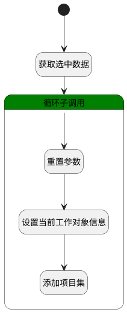

## 添加项目集 <!-- {docsify-ignore-all} -->

   项目集下添加子项目集。注：只可选择无子项目集的，预防反复嵌套

### 处理过程




### 处理步骤说明

#### 开始 :id=Begin<sup class="footnote-symbol"> <font color=gray size=1>[开始]</font></sup>


*- N/A*
#### 获取选中数据 :id=PREPAREPARAM2<sup class="footnote-symbol"> <font color=gray size=1>[准备参数]</font></sup>


1. 将`Default(传入变量).srfactionparam` 绑定给  `srfactionparam(所选项目列表)`

#### 循环子调用 :id=LOOPSUBCALL1<sup class="footnote-symbol"> <font color=gray size=1>[循环子调用]</font></sup>


循环参数`srfactionparam(所选项目列表)`，子循环参数使用`for_temp_obj(循环临时变量)`
#### 重置参数 :id=RESETPARAM1<sup class="footnote-symbol"> <font color=gray size=1>[重置参数]</font></sup>


重置参数```create_obj(工作对象)```
#### 设置当前工作对象信息 :id=PREPAREPARAM1<sup class="footnote-symbol"> <font color=gray size=1>[准备参数]</font></sup>


1. 将`for_temp_obj(循环临时变量).ID(标识)` 设置给  `create_obj(工作对象).PRINCIPAL_ID(关联主体标识)`
2. 将`Default(传入变量).portfolio` 设置给  `create_obj(工作对象).PORTFOLIO_ID(文件夹标识)`
3. 将`project_portfolio` 设置给  `create_obj(工作对象).PRINCIPAL_TYPE(关联主体类型)`

#### 添加项目集 :id=DEACTION1<sup class="footnote-symbol"> <font color=gray size=1>[实体行为]</font></sup>


调用实体 [工作(WORK)](module/Base/work.md) 行为 [Save](module/Base/work#行为) ，行为参数为`create_obj(工作对象)`


### 实体逻辑参数

|    中文名   |    代码名    |  数据类型    |  实体   |备注 |
| --------| --------| -------- | -------- | --------   |
|传入变量(<i class="fa fa-check"/></i>)|Default|数据对象|[工作(WORK)](module/Base/work.md)||
|工作对象|create_obj|数据对象|[工作(WORK)](module/Base/work.md)||
|循环临时变量|for_temp_obj|数据对象|[文件夹(PORTFOLIO)](module/Base/portfolio.md)||
|所选项目列表|srfactionparam|数据对象列表|[文件夹(PORTFOLIO)](module/Base/portfolio.md)||
