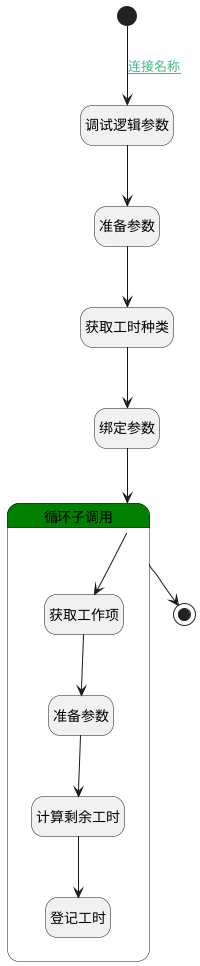

## AI登记预估工时 <!-- {docsify-ignore-all} -->

   

### 处理过程




### 处理步骤说明

#### 开始 :id=Begin<sup class="footnote-symbol"> <font color=gray size=1>[开始]</font></sup>


*- N/A*
#### 调试逻辑参数 :id=DEBUGPARAM_01<sup class="footnote-symbol"> <font color=gray size=1>[调试逻辑参数]</font></sup>


> [!NOTE|label:调试信息|icon:fa fa-bug]
> 调试输出参数`Default(传入变量)`的详细信息


#### 准备参数 :id=PREPAREPARAM2<sup class="footnote-symbol"> <font color=gray size=1>[准备参数]</font></sup>


1. 将`Default(传入变量).principal_id(工时主体标识)` 设置给  `work_item.ID(标识)`

#### 获取工时种类 :id=DEDATASET1<sup class="footnote-symbol"> <font color=gray size=1>[实体数据集]</font></sup>


调用实体 [工时类别(WORKLOAD_TYPE)](module/Base/workload_type.md) 数据集合 [数据集(DEFAULT)](module/Base/workload_type#数据集合) ，查询参数为`filter(workload_type)`

将执行结果返回给参数`workload_type_page`

#### 绑定参数 :id=BINDPARAM1<sup class="footnote-symbol"> <font color=gray size=1>[绑定参数]</font></sup>


绑定参数`Default(传入变量)` 到 `data`
#### 循环子调用 :id=LOOPSUBCALL1<sup class="footnote-symbol"> <font color=gray size=1>[循环子调用]</font></sup>


循环参数`data`，子循环参数使用`temp`
#### 获取工作项 :id=DEACTION1<sup class="footnote-symbol"> <font color=gray size=1>[实体行为]</font></sup>


调用实体 [工作项(WORK_ITEM)](module/ProjMgmt/work_item.md) 行为 [Get](module/ProjMgmt/work_item#行为) ，行为参数为`work_item`

将执行结果返回给参数`work_item`

#### 准备参数 :id=PREPAREPARAM1<sup class="footnote-symbol"> <font color=gray size=1>[准备参数]</font></sup>


1. 将`Default(传入变量).principal_id(工时主体标识)` 设置给  `temp.PRINCIPAL_ID(工时主体标识)`
2. 将`work_item.TITLE(标题)` 设置给  `temp.NAME(事项)`
3. 将`Default(传入变量).register_date(工作日期)` 设置给  `temp.REGISTER_DATE(工作日期)`
4. 将`ESTIMATED_WORKLOAD` 设置给  `temp.CATEGORY(工时类别)`
5. 将`工作项` 设置给  `temp.workload_kind`

#### 计算剩余工时 :id=RAWSFCODE1<sup class="footnote-symbol"> <font color=gray size=1>[直接后台代码]</font></sup>


<p class="panel-title"><b>执行代码[Groovy]</b></p>

```groovy
def _default = logic.param('Default').getReal()
def work_item = logic.param('work_item').getReal()
def temp = logic.param('temp').getReal()
def workload_type_page = logic.param('workload_type_page').getReal()

def remaining_workload = (work_item.get('estimated_workload') ?: 0) + temp.get('duration') - (work_item.get('actual_workload') ?: 0)
remaining_workload = (remaining_workload < 0) ? 0 : remaining_workload
temp.set('remaining_workload', remaining_workload)

workload_type_page.each { i ->
    if (i.get('name') == temp.get('type_name')) {
        temp.set('type_id', i.get('id'))
    }
}
```

#### 登记工时 :id=DELOGIC1<sup class="footnote-symbol"> <font color=gray size=1>[实体逻辑]</font></sup>


调用实体 [工时(WORKLOAD)](module/Base/workload.md) 处理逻辑 [登记工时并更新剩余工时]((module/Base/workload/logic/save_workload.md)) ，行为参数为`temp(temp)`

#### 结束 :id=END1<sup class="footnote-symbol"> <font color=gray size=1>[结束]</font></sup>


*- N/A*


### 连接条件说明
#### 连接名称 :id=Begin-DEBUGPARAM_01

`Default(传入变量).success` EQ `true`


### 实体逻辑参数

|    中文名   |    代码名    |  数据类型    |  实体   |备注 |
| --------| --------| -------- | -------- | --------   |
|传入变量(<i class="fa fa-check"/></i>)|Default|数据对象|[工时(WORKLOAD)](module/Base/workload.md)||
|data|data|数据对象列表|[工时(WORKLOAD)](module/Base/workload.md)||
|workload_type|filter|过滤器|||
|temp|temp|数据对象|[工时(WORKLOAD)](module/Base/workload.md)||
|work_item|work_item|数据对象|[工作项(WORK_ITEM)](module/ProjMgmt/work_item.md)||
|workload_type_page|workload_type_page|分页查询|||
