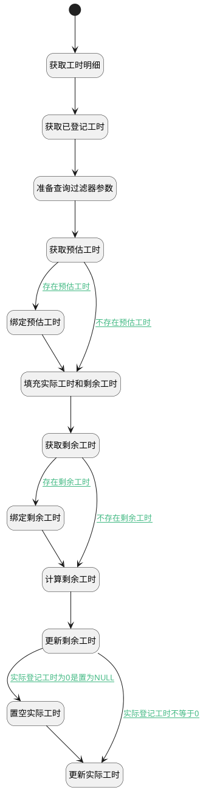

## 删除工时记录前附加逻辑 <!-- {docsify-ignore-all} -->

   更新动态存储中的剩余工时

### 处理过程




### 处理步骤说明

#### 开始 :id=Begin<sup class="footnote-symbol"> <font color=gray size=1>[开始]</font></sup>


*- N/A*
#### 获取工时明细 :id=DEACTION1<sup class="footnote-symbol"> <font color=gray size=1>[实体行为]</font></sup>


调用实体 [工时(WORKLOAD)](module/Base/workload.md) 行为 [Get](module/Base/workload#行为) ，行为参数为`Default(传入变量)`

将执行结果返回给参数`Default(传入变量)`

#### 获取已登记工时 :id=RAWSQLCALL2<sup class="footnote-symbol"> <font color=gray size=1>[直接SQL调用]</font></sup>


<p class="panel-title"><b>执行sql语句</b></p>

```sql
select sum(DURATION) as `DURATION` from workload where  PRINCIPAL_TYPE = ? and PRINCIPAL_ID = ?
```

<p class="panel-title"><b>执行sql参数</b></p>

1. `Default(传入变量).PRINCIPAL_TYPE(工时主体类型)`
2. `Default(传入变量).PRINCIPAL_ID(工时主体标识)`

重置参数`total_register(已登记总工时)`，并将执行sql结果赋值给参数`total_register(已登记总工时)`

#### 准备查询过滤器参数 :id=PREPAREPARAM1<sup class="footnote-symbol"> <font color=gray size=1>[准备参数]</font></sup>


1. 将`Default(传入变量).PRINCIPAL_ID(工时主体标识)` 设置给  `filter(过滤器).n_owner_id_eq`
2. 将`Default(传入变量).PRINCIPAL_TYPE(工时主体类型)` 设置给  `filter(过滤器).n_owner_type_eq`
3. 将`ESTIMATED_WORKLOAD` 设置给  `filter(过滤器).n_name_eq`

#### 获取预估工时 :id=DEDATASET1<sup class="footnote-symbol"> <font color=gray size=1>[实体数据集]</font></sup>


调用实体 [扩展存储(EXTEND_STORAGE)](module/Base/extend_storage.md) 数据集合 [数据集(DEFAULT)](module/Base/extend_storage#数据集合) ，查询参数为`filter(过滤器)`

将执行结果返回给参数`estimated_page(预估工时查询结果对象)`

#### 绑定预估工时 :id=BINDPARAM1<sup class="footnote-symbol"> <font color=gray size=1>[绑定参数]</font></sup>


绑定参数`estimated_page(预估工时查询结果对象)` 到 `estimated(预估工时)`
#### 填充实际工时和剩余工时 :id=PREPAREPARAM2<sup class="footnote-symbol"> <font color=gray size=1>[准备参数]</font></sup>


1. 将`REMAINING_WORKLOAD` 设置给  `filter(过滤器).n_name_eq`
2. 将`Default(传入变量).PRINCIPAL_ID(工时主体标识)` 设置给  `actual(实际工时).OWNER_ID(所属数据标识)`
3. 将`ACTUAL_WORKLOAD` 设置给  `actual(实际工时).NAME(名称)`
4. 将`Default(传入变量).PRINCIPAL_TYPE(工时主体类型)` 设置给  `actual(实际工时).OWNER_TYPE(所属数据对象)`
5. 将`Default(传入变量).PRINCIPAL_ID(工时主体标识)` 设置给  `remaining(剩余工时).OWNER_ID(所属数据标识)`
6. 将`Default(传入变量).PRINCIPAL_TYPE(工时主体类型)` 设置给  `remaining(剩余工时).OWNER_TYPE(所属数据对象)`
7. 将`REMAINING_WORKLOAD` 设置给  `remaining(剩余工时).NAME(名称)`

#### 获取剩余工时 :id=DEDATASET2<sup class="footnote-symbol"> <font color=gray size=1>[实体数据集]</font></sup>


调用实体 [扩展存储(EXTEND_STORAGE)](module/Base/extend_storage.md) 数据集合 [数据集(DEFAULT)](module/Base/extend_storage#数据集合) ，查询参数为`filter(过滤器)`

将执行结果返回给参数`remaining_page(剩余工时查询结果对象)`

#### 绑定剩余工时 :id=BINDPARAM2<sup class="footnote-symbol"> <font color=gray size=1>[绑定参数]</font></sup>


绑定参数`remaining_page(剩余工时查询结果对象)` 到 `remaining(剩余工时)`
#### 计算剩余工时 :id=RAWSFCODE1<sup class="footnote-symbol"> <font color=gray size=1>[直接后台代码]</font></sup>


<p class="panel-title"><b>执行代码[JavaScript]</b></p>

```javascript
var defaultObj = logic.getParam("default");
var remainingObj = logic.getParam("remaining"); // 剩余工时对象
var estimatedObj = logic.getParam("estimated"); // 预估工时对象
var actualObj = logic.getParam("actual"); // 实际工时对象

var total_register = logic.getParam("total_register"); // 总登记时长
var actual_workload = total_register.get("duration") == null ? 0 : Number(total_register.get("duration"));
var estimated_workload = estimatedObj.get("decimal_value") == null ? 0 : Number(estimatedObj.get("decimal_value"));
var duration = defaultObj.get("duration") == null ? 0 : Number(defaultObj.get("duration"));
sys.info("查询预估工时=", estimated_workload);
sys.info("查询总登记工时=", actual_workload);
// 重新计算剩余工时
var remaining = estimated_workload - (actual_workload - duration);
if(remaining < 0){
    remaining = 0;
}
remainingObj.set("decimal_value", remaining);
// 计算实际工时
var actual = (actual_workload - duration) <= 0 ? 0 : actual_workload - duration;
actualObj.set("decimal_value", actual);

```

#### 更新剩余工时 :id=DEACTION2<sup class="footnote-symbol"> <font color=gray size=1>[实体行为]</font></sup>


调用实体 [扩展存储(EXTEND_STORAGE)](module/Base/extend_storage.md) 行为 [Save](module/Base/extend_storage#行为) ，行为参数为`remaining(剩余工时)`

#### 置空实际工时 :id=PREPAREPARAM3<sup class="footnote-symbol"> <font color=gray size=1>[准备参数]</font></sup>


1. 将`空值（NULL）` 设置给  `actual(实际工时).DECIMAL_VALUE(数值值)`

#### 更新实际工时 :id=DEACTION3<sup class="footnote-symbol"> <font color=gray size=1>[实体行为]</font></sup>


调用实体 [扩展存储(EXTEND_STORAGE)](module/Base/extend_storage.md) 行为 [Save](module/Base/extend_storage#行为) ，行为参数为`actual(实际工时)`

将执行结果返回给参数`actual(实际工时)`


### 连接条件说明
#### 不存在预估工时 :id=DEDATASET1-PREPAREPARAM2

`estimated_page(预估工时查询结果对象).size` EQ `0`
#### 存在剩余工时 :id=DEDATASET2-BINDPARAM2

`remaining_page(剩余工时查询结果对象).size` GT `0`
#### 实际登记工时为0是置为NULL :id=DEACTION2-PREPAREPARAM3

`actual(实际工时).DECIMAL_VALUE(数值值)` EQ `0`
#### 实际登记工时不等于0 :id=DEACTION2-DEACTION3

`actual(实际工时).DECIMAL_VALUE(数值值)` NOTEQ `0`
#### 不存在剩余工时 :id=DEDATASET2-RAWSFCODE1

`remaining_page(剩余工时查询结果对象).size` EQ `0`
#### 存在预估工时 :id=DEDATASET1-BINDPARAM1

`estimated_page(预估工时查询结果对象).size` GT `0`


### 实体逻辑参数

|    中文名   |    代码名    |  数据类型    |  实体   |备注 |
| --------| --------| -------- | -------- | --------   |
|传入变量(<i class="fa fa-check"/></i>)|Default|数据对象|[工时(WORKLOAD)](module/Base/workload.md)||
|实际工时|actual|数据对象|[扩展存储(EXTEND_STORAGE)](module/Base/extend_storage.md)||
|预估工时|estimated|数据对象|[扩展存储(EXTEND_STORAGE)](module/Base/extend_storage.md)||
|预估工时查询结果对象|estimated_page|分页查询|||
|过滤器|filter|过滤器|||
|剩余工时|remaining|数据对象|[扩展存储(EXTEND_STORAGE)](module/Base/extend_storage.md)||
|剩余工时查询结果对象|remaining_page|分页查询|||
|已登记总工时|total_register|数据对象|[工时(WORKLOAD)](module/Base/workload.md)||
