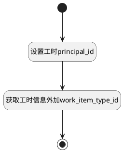

## 填充工时数据 <!-- {docsify-ignore-all} -->

   移动端，工时日历详情使用

### 处理过程




### 处理步骤说明

#### 开始 :id=Begin<sup class="footnote-symbol"> <font color=gray size=1>[开始]</font></sup>


*- N/A*
#### 设置工时principal_id :id=PREPAREPARAM1<sup class="footnote-symbol"> <font color=gray size=1>[准备参数]</font></sup>


1. 将`Default(传入变量).n_principal_id_eq` 设置给  `obj(工时).PRINCIPAL_ID`

#### 获取工时信息外加work_item_type_id :id=RAWSQLCALL1<sup class="footnote-symbol"> <font color=gray size=1>[直接SQL调用]</font></sup>


<p class="panel-title"><b>执行sql语句</b></p>

```sql
SELECT t1.PRINCIPAL_ID,
       t1.PRINCIPAL_TYPE,
       t1.DURATION,
       t2.WORK_ITEM_TYPE_ID,
       t1.`ID`,
       t1.`NAME`,
       t1.`PRINCIPAL_TYPE`,
       concat(t1.`RECENT_PARENT_IDENTIFIER`, '-', t1.`IDENTIFIER`) AS `SHOW_IDENTIFIER`
FROM workload t1
         LEFT JOIN `work_item` t2 ON t1.PRINCIPAL_ID = t2.ID
where t1.PRINCIPAL_ID = ? limit 1
```

<p class="panel-title"><b>执行sql参数</b></p>

1. `obj(工时).principal_id`

重置参数`result(结果)`，并将执行sql结果赋值给参数`result(结果)`

#### 结束 :id=END1<sup class="footnote-symbol"> <font color=gray size=1>[结束]</font></sup>


返回 `result(结果)`


### 实体逻辑参数

|    中文名   |    代码名    |  数据类型    |  实体   |备注 |
| --------| --------| -------- | -------- | --------   |
|传入变量(<i class="fa fa-check"/></i>)|Default|数据对象|[工时(WORKLOAD)](module/Base/workload.md)||
|工时|obj|数据对象|||
|结果|result|数据对象|[工时(WORKLOAD)](module/Base/workload.md)||
