## 获取已登记工时 <!-- {docsify-ignore-all} -->

   查看工时详情时，获取预估、已登记、剩余工时；并计算出工时进度

### 处理过程

```plantuml
@startuml
hide empty description
<style>
root {
  HyperlinkColor #42b983
}
</style>

hide empty description
state "开始" as Begin <<start>> [[$./get_register_workload#begin {"开始"}]]
state "获取工时明细" as DEACTION1  [[$./get_register_workload#deaction1 {"获取工时明细"}]]
state "获取已登记工时" as RAWSQLCALL1  [[$./get_register_workload#rawsqlcall1 {"获取已登记工时"}]]
state "获取剩余工时" as RAWSQLCALL2  [[$./get_register_workload#rawsqlcall2 {"获取剩余工时"}]]
state "获取预估工时" as RAWSQLCALL3  [[$./get_register_workload#rawsqlcall3 {"获取预估工时"}]]
state "计算进度" as RAWSFCODE1  [[$./get_register_workload#rawsfcode1 {"计算进度"}]]
state "结束" as END1 <<end>> [[$./get_register_workload#end1 {"结束"}]]


Begin --> DEACTION1
DEACTION1 --> RAWSQLCALL1
RAWSQLCALL1 --> RAWSQLCALL2
RAWSQLCALL2 --> RAWSQLCALL3
RAWSQLCALL3 --> RAWSFCODE1
RAWSFCODE1 --> END1


@enduml
```




### 处理步骤说明

#### 开始 :id=Begin<sup class="footnote-symbol"> <font color=gray size=1>[开始]</font></sup>


*- N/A*
#### 获取工时明细 :id=DEACTION1<sup class="footnote-symbol"> <font color=gray size=1>[实体行为]</font></sup>


调用实体 [工时(WORKLOAD)](module/Base/workload.md) 行为 [Get](module/Base/workload#行为) ，行为参数为`Default(传入变量)`

将执行结果返回给参数`Default(传入变量)`

#### 获取已登记工时 :id=RAWSQLCALL1<sup class="footnote-symbol"> <font color=gray size=1>[直接SQL调用]</font></sup>


<p class="panel-title"><b>执行sql语句</b></p>

```sql
select sum(DURATION) as `ACTUAL_WORKLOAD` from workload where  PRINCIPAL_TYPE = ? and PRINCIPAL_ID = ?
```

<p class="panel-title"><b>执行sql参数</b></p>

1. `Default(传入变量).PRINCIPAL_TYPE(工时主体类型)`
2. `Default(传入变量).PRINCIPAL_ID(工时主体标识)`

重置参数`Default(传入变量)`，并将执行sql结果赋值给参数`Default(传入变量)`

#### 获取剩余工时 :id=RAWSQLCALL2<sup class="footnote-symbol"> <font color=gray size=1>[直接SQL调用]</font></sup>


<p class="panel-title"><b>执行sql语句</b></p>

```sql
select DECIMAL_VALUE as `REMAINING_WORKLOAD` from `extend_storage` where  OWNER_ID = ? and OWNER_TYPE = ? and `NAME` = 'REMAINING_WORKLOAD'
```

<p class="panel-title"><b>执行sql参数</b></p>

1. `Default(传入变量).PRINCIPAL_ID(工时主体标识)`
2. `Default(传入变量).PRINCIPAL_TYPE(工时主体类型)`

重置参数`Default(传入变量)`，并将执行sql结果赋值给参数`Default(传入变量)`

#### 获取预估工时 :id=RAWSQLCALL3<sup class="footnote-symbol"> <font color=gray size=1>[直接SQL调用]</font></sup>


<p class="panel-title"><b>执行sql语句</b></p>

```sql
select DECIMAL_VALUE as `ESTIMATED_WORKLOAD` from `extend_storage` where  OWNER_ID = ? and OWNER_TYPE = ? and `NAME` = 'ESTIMATED_WORKLOAD'
```

<p class="panel-title"><b>执行sql参数</b></p>

1. `Default(传入变量).PRINCIPAL_ID(工时主体标识)`
2. `Default(传入变量).PRINCIPAL_TYPE(工时主体类型)`

重置参数`Default(传入变量)`，并将执行sql结果赋值给参数`Default(传入变量)`

#### 计算进度 :id=RAWSFCODE1<sup class="footnote-symbol"> <font color=gray size=1>[直接后台代码]</font></sup>


<p class="panel-title"><b>执行代码[JavaScript]</b></p>

```javascript
var defaultObj = logic.getParam("default");
var remaining_workload = defaultObj.get("remaining_workload") == null ? 0 : Number(defaultObj.get("remaining_workload"));
var actual_workload = defaultObj.get("actual_workload") == null ? 0 : Number(defaultObj.get("actual_workload"));
var estimated_workload = defaultObj.get("estimated_workload") == null ? 0 : Number(defaultObj.get("estimated_workload"));
var duration = defaultObj.get("duration") == null ? 0 : Number(defaultObj.get("duration"));
var actual = actual_workload - duration;
if(actual <= 0){
    defaultObj.set("actual_workload", null);
} else {
    defaultObj.set("actual_workload", actual);
}
// 计算工时进度
if((actual_workload + remaining_workload) != 0){
    var schedule = ((actual_workload / (actual_workload + remaining_workload)) * 100).toFixed(1);
    defaultObj.set("workload_schedule", schedule);
}
var principal_type = defaultObj.get("principal_type");
if(principal_type == 'WORK_ITEM'){
    defaultObj.set("workload_kind", "工作项");
}
if(principal_type == 'IDEA'){
    defaultObj.set("workload_kind", "产品需求");
}
if(principal_type == 'TEST_CASE'){
    defaultObj.set("workload_kind", "测试用例");
}

```

#### 结束 :id=END1<sup class="footnote-symbol"> <font color=gray size=1>[结束]</font></sup>


返回 `Default(传入变量)`


### 实体逻辑参数

|    中文名   |    代码名    |  数据类型    |  实体   |备注 |
| --------| --------| -------- | -------- | --------   |
|传入变量(<i class="fa fa-check"/></i>)|Default|数据对象|[工时(WORKLOAD)](module/Base/workload.md)||
