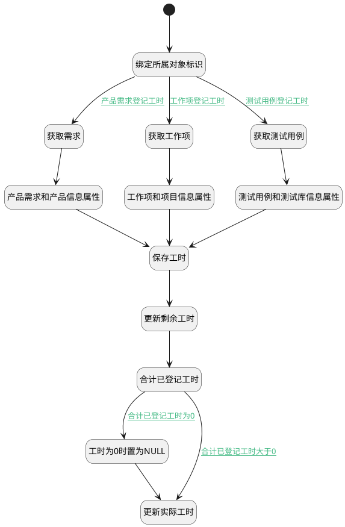

## 登记工时并更新剩余工时 <!-- {docsify-ignore-all} -->

   保存实际登记工时记录，并计算重置剩余工时属性

### 处理过程




### 处理步骤说明

#### 开始 :id=Begin<sup class="footnote-symbol"> <font color=gray size=1>[开始]</font></sup>


*- N/A*
#### 绑定所属对象标识 :id=PREPAREPARAM2<sup class="footnote-symbol"> <font color=gray size=1>[准备参数]</font></sup>


1. 将`Default(传入变量).PRINCIPAL_ID(工时主体标识)` 设置给  `test_case(测试用例).ID(标识)`
2. 将`Default(传入变量).PRINCIPAL_ID(工时主体标识)` 设置给  `actual(实际工时).OWNER_ID(所属数据标识)`
3. 将`Default(传入变量).PRINCIPAL_ID(工时主体标识)` 设置给  `actual(实际工时).OWNER_ID(所属数据标识)`
4. 将`REMAINING_WORKLOAD` 设置给  `remaining(剩余工时).NAME(名称)`
5. 将`Default(传入变量).PRINCIPAL_ID(工时主体标识)` 设置给  `remaining(剩余工时).OWNER_ID(所属数据标识)`
6. 将`Default(传入变量).REMAINING_WORKLOAD` 设置给  `remaining(剩余工时).DECIMAL_VALUE(数值值)`
7. 将`Default(传入变量).PRINCIPAL_ID(工时主体标识)` 设置给  `work_item(工作项).ID(标识)`
8. 将`Default(传入变量).PRINCIPAL_ID(工时主体标识)` 设置给  `idea(产品需求).ID(标识)`

#### 获取需求 :id=DEACTION3<sup class="footnote-symbol"> <font color=gray size=1>[实体行为]</font></sup>


调用实体 [需求(IDEA)](module/ProdMgmt/idea.md) 行为 [Get](module/ProdMgmt/idea#行为) ，行为参数为`idea(产品需求)`

将执行结果返回给参数`idea(产品需求)`

#### 获取工作项 :id=DEACTION4<sup class="footnote-symbol"> <font color=gray size=1>[实体行为]</font></sup>


调用实体 [工作项(WORK_ITEM)](module/ProjMgmt/work_item.md) 行为 [Get](module/ProjMgmt/work_item#行为) ，行为参数为`work_item(工作项)`

将执行结果返回给参数`work_item(工作项)`

#### 获取测试用例 :id=DEACTION5<sup class="footnote-symbol"> <font color=gray size=1>[实体行为]</font></sup>


调用实体 [用例(TEST_CASE)](module/TestMgmt/test_case.md) 行为 [Get](module/TestMgmt/test_case#行为) ，行为参数为`test_case(测试用例)`

将执行结果返回给参数`test_case(测试用例)`

#### 产品需求和产品信息属性 :id=PREPAREPARAM4<sup class="footnote-symbol"> <font color=gray size=1>[准备参数]</font></sup>


1. 将`idea(产品需求).IDENTIFIER(编号)` 设置给  `Default(传入变量).IDENTIFIER(编号)`
2. 将`IDEA` 设置给  `actual(实际工时).OWNER_TYPE(所属数据对象)`
3. 将`ACTUAL_WORKLOAD` 设置给  `actual(实际工时).NAME(名称)`
4. 将`IDEA` 设置给  `remaining(剩余工时).OWNER_TYPE(所属数据对象)`
5. 将`idea(产品需求).PRODUCT_ID(产品)` 设置给  `Default(传入变量).RECENT_PARENT(访问父类)`
6. 将`idea(产品需求).PRODUCT_NAME(所属产品)` 设置给  `Default(传入变量).RECENT_PARENT_NAME(访问父类名称)`
7. 将`idea(产品需求).PRODUCT_IDENTIFIER(产品标识)` 设置给  `Default(传入变量).RECENT_PARENT_IDENTIFIER(访问父类编号)`
8. 将`idea(产品需求).TITLE(标题)` 设置给  `Default(传入变量).NAME(事项)`
9. 将`IDEA` 设置给  `Default(传入变量).PRINCIPAL_TYPE(工时主体类型)`

#### 工作项和项目信息属性 :id=PREPAREPARAM3<sup class="footnote-symbol"> <font color=gray size=1>[准备参数]</font></sup>


1. 将`work_item(工作项).IDENTIFIER(编号)` 设置给  `Default(传入变量).IDENTIFIER(编号)`
2. 将`ACTUAL_WORKLOAD` 设置给  `actual(实际工时).NAME(名称)`
3. 将`WORK_ITEM` 设置给  `actual(实际工时).OWNER_TYPE(所属数据对象)`
4. 将`WORK_ITEM` 设置给  `remaining(剩余工时).OWNER_TYPE(所属数据对象)`
5. 将`WORK_ITEM` 设置给  `Default(传入变量).PRINCIPAL_TYPE(工时主体类型)`
6. 将`work_item(工作项).PROJECT_ID(项目)` 设置给  `Default(传入变量).RECENT_PARENT(访问父类)`
7. 将`work_item(工作项).PROJECT_IDENTIFIER(项目标识)` 设置给  `Default(传入变量).RECENT_PARENT_IDENTIFIER(访问父类编号)`
8. 将`work_item(工作项).PROJECT_NAME(所属项目)` 设置给  `Default(传入变量).RECENT_PARENT_NAME(访问父类名称)`
9. 将`work_item(工作项).TITLE(标题)` 设置给  `Default(传入变量).NAME(事项)`

#### 测试用例和测试库信息属性 :id=PREPAREPARAM5<sup class="footnote-symbol"> <font color=gray size=1>[准备参数]</font></sup>


1. 将`test_case(测试用例).IDENTIFIER(编号)` 设置给  `Default(传入变量).IDENTIFIER(编号)`
2. 将`TEST_CASE` 设置给  `actual(实际工时).OWNER_TYPE(所属数据对象)`
3. 将`ACTUAL_WORKLOAD` 设置给  `actual(实际工时).NAME(名称)`
4. 将`TEST_CASE` 设置给  `remaining(剩余工时).OWNER_TYPE(所属数据对象)`
5. 将`test_case(测试用例).LIBRARY_IDENTIFIER(测试库标识)` 设置给  `Default(传入变量).RECENT_PARENT_IDENTIFIER(访问父类编号)`
6. 将`test_case(测试用例).TEST_LIBRARY_ID(测试库)` 设置给  `Default(传入变量).RECENT_PARENT(访问父类)`
7. 将`test_case(测试用例).TEST_LIBRARY_NAME(所属测试库)` 设置给  `Default(传入变量).NAME(事项)`
8. 将`test_case(测试用例).TITLE(标题)` 设置给  `Default(传入变量).NAME(事项)`
9. 将`TEST_CASE` 设置给  `Default(传入变量).PRINCIPAL_TYPE(工时主体类型)`

#### 保存工时 :id=DEACTION2<sup class="footnote-symbol"> <font color=gray size=1>[实体行为]</font></sup>


调用实体 [工时(WORKLOAD)](module/Base/workload.md) 行为 [Save](module/Base/workload#行为) ，行为参数为`Default(传入变量)`

将执行结果返回给参数`Default(传入变量)`

#### 更新剩余工时 :id=DEACTION6<sup class="footnote-symbol"> <font color=gray size=1>[实体行为]</font></sup>


调用实体 [扩展存储(EXTEND_STORAGE)](module/Base/extend_storage.md) 行为 [Save](module/Base/extend_storage#行为) ，行为参数为`remaining(剩余工时)`

#### 合计已登记工时 :id=RAWSQLCALL1<sup class="footnote-symbol"> <font color=gray size=1>[直接SQL调用]</font></sup>


<p class="panel-title"><b>执行sql语句</b></p>

```sql
select sum(DURATION) as `DECIMAL_VALUE` from `workload` where PRINCIPAL_ID = ? and PRINCIPAL_TYPE = ?
```

<p class="panel-title"><b>执行sql参数</b></p>

1. `actual(实际工时).OWNER_ID(所属数据标识)`
2. `actual(实际工时).OWNER_TYPE(所属数据对象)`

重置参数`actual(实际工时)`，并将执行sql结果赋值给参数`actual(实际工时)`

#### 工时为0时置为NULL :id=PREPAREPARAM6<sup class="footnote-symbol"> <font color=gray size=1>[准备参数]</font></sup>


1. 将`空值（NULL）` 设置给  `actual(实际工时).DECIMAL_VALUE(数值值)`

#### 更新实际工时 :id=DEACTION7<sup class="footnote-symbol"> <font color=gray size=1>[实体行为]</font></sup>


调用实体 [扩展存储(EXTEND_STORAGE)](module/Base/extend_storage.md) 行为 [Save](module/Base/extend_storage#行为) ，行为参数为`actual(实际工时)`

将执行结果返回给参数`actual(实际工时)`


### 连接条件说明
#### 产品需求登记工时 :id=PREPAREPARAM2-DEACTION3

`Default(传入变量).workload_kind` EQ `产品需求`
#### 合计已登记工时大于0 :id=RAWSQLCALL1-DEACTION7

`actual(实际工时).DECIMAL_VALUE(数值值)` NOTEQ `0`
#### 合计已登记工时为0 :id=RAWSQLCALL1-PREPAREPARAM6

`actual(实际工时).DATETIME_VALUE(时间值)` EQ `0`
#### 工作项登记工时 :id=PREPAREPARAM2-DEACTION4

`Default(传入变量).workload_kind` EQ `工作项`
#### 测试用例登记工时 :id=PREPAREPARAM2-DEACTION5

`Default(传入变量).workload_kind` EQ `测试用例`


### 实体逻辑参数

|    中文名   |    代码名    |  数据类型    |  实体   |备注 |
| --------| --------| -------- | -------- | --------   |
|传入变量(<i class="fa fa-check"/></i>)|Default|数据对象|[工时(WORKLOAD)](module/Base/workload.md)||
|实际工时|actual|数据对象|[扩展存储(EXTEND_STORAGE)](module/Base/extend_storage.md)||
|产品需求|idea|数据对象|[需求(IDEA)](module/ProdMgmt/idea.md)||
|剩余工时|remaining|数据对象|[扩展存储(EXTEND_STORAGE)](module/Base/extend_storage.md)||
|测试用例|test_case|数据对象|[用例(TEST_CASE)](module/TestMgmt/test_case.md)||
|工作项|work_item|数据对象|[工作项(WORK_ITEM)](module/ProjMgmt/work_item.md)||
