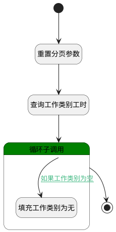

## 工作类别维度管理工时日历查询 <!-- {docsify-ignore-all} -->

   工时管理菜单中工时日历：工作类型维度查询数据使用

### 处理过程

### 处理步骤说明

#### 开始 :id=Begin [开始]

*- N/A*
#### 重置分页参数 :id=PREPAREPARAM1 [准备参数]

1. 将`1000` 设置给  `Default(传入变量).size`

#### 填充工作类别为无 :id=PREPAREPARAM2 [准备参数]

1. 将`无` 设置给  `for_temp(循环临时变量).TYPE_NAME(名称)`

#### 查询工作类别工时 :id=DEDATASET1 [实体数据集]

调用实体 [工时(WORKLOAD)](module/Base/workload.md) 数据集合 [工作类别记录(type_of)](module/Base/workload#数据集合) ，查询参数为`Default(传入变量)`

将执行结果返回给参数`page(分页查询结果变量)`

#### 循环子调用 :id=LOOPSUBCALL1 [循环子调用]

循环参数`page(分页查询结果变量)`，子循环参数使用`for_temp(循环临时变量)`
#### 结束 :id=END1 [结束]

返回 `page(分页查询结果变量)`

### 连接条件说明
#### 如果工作类别为空 :id=LOOPSUBCALL1-PREPAREPARAM2

`for_temp(循环临时变量).TYPE_ID(类别)` ISNULL

### 实体逻辑参数

|    中文名   |    代码名    |  数据类型    |  实体   |备注 |
| --------| --------| -------- | -------- | --------   |
|传入变量(<i class="fa fa-check"/></i>)|Default|过滤器|||
|循环临时变量|for_temp|数据对象|[工时(WORKLOAD)](module/Base/workload.md)||
|分页查询结果变量|page|分页查询|||
