## 团队维度工时日历查询 <!-- {docsify-ignore-all} -->

   工时管理菜单中工时日历：团队维度查询数据使用

### 处理过程

```plantuml
@startuml
hide empty description
<style>
root {
  HyperlinkColor #42b983
}
</style>

hide empty description
state "开始" as Begin <<start>> [[$./user_group_dimension#begin {"开始"}]]
state "设置分页参数" as PREPAREPARAM1  [[$./user_group_dimension#prepareparam1 {"设置分页参数"}]]
state "查询团队工时记录" as DEDATASET1  [[$./user_group_dimension#dedataset1 {"查询团队工时记录"}]]
state "结束" as END1 <<end>> [[$./user_group_dimension#end1 {"结束"}]]


Begin --> PREPAREPARAM1
PREPAREPARAM1 --> DEDATASET1
DEDATASET1 --> END1


@enduml
```

### 处理步骤说明

#### 开始 :id=Begin [开始]

*- N/A*
#### 设置分页参数 :id=PREPAREPARAM1 [准备参数]

1. 将`10000` 设置给  `Default(传入变量).size`

#### 查询团队工时记录 :id=DEDATASET1 [实体数据集]

调用实体 [工时(WORKLOAD)](module/Base/workload.md) 数据集合 [团队工时(user_group_workload)](module/Base/workload#数据集合) ，查询参数为`Default(传入变量)`

将执行结果返回给参数`result_page(查询分页结果变量)`

#### 结束 :id=END1 [结束]

返回 `result_page(查询分页结果变量)`

### 实体逻辑参数

|    中文名   |    代码名    |  数据类型    |  实体   |备注 |
| --------| --------| -------- | -------- | --------   |
|传入变量(<i class="fa fa-check"/></i>)|Default|过滤器|||
|查询分页结果变量|result_page|分页查询|||
