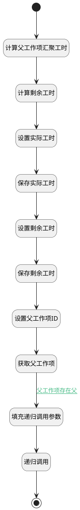

## 工时自动计算 <!-- {docsify-ignore-all} -->

   修改当前逻辑，在当前逻辑内进行递归调用，调用别的逻辑，不去调用原保存变更逻辑了。

### 处理过程




### 处理步骤说明

#### 开始 :id=Begin<sup class="footnote-symbol"> <font color=gray size=1>[开始]</font></sup>


*- N/A*
#### 计算父工作项汇聚工时 :id=RAWSQLCALL1<sup class="footnote-symbol"> <font color=gray size=1>[直接SQL调用]</font></sup>


<p class="panel-title"><b>执行sql语句</b></p>

```sql
select 
IFNULL(sum(case when name='ACTUAL_WORKLOAD' then DECIMAL_VALUE else 0 end),0) as 'actual_workload',
IFNULL(sum(case when name='ESTIMATED_WORKLOAD' then DECIMAL_VALUE else 0 end),0) as 'estimated_workload'
 from extend_storage t where   exists (select 1 from work_item a where PID=? and t.owner_id=a.id)
```

<p class="panel-title"><b>执行sql参数</b></p>

1. `Default(传入变量).PRINCIPAL_ID(工时主体标识)`

将执行sql结果赋值给参数`workload_data(工时数据)`

#### 计算剩余工时 :id=RAWSFCODE2<sup class="footnote-symbol"> <font color=gray size=1>[直接后台代码]</font></sup>


<p class="panel-title"><b>执行代码[JavaScript]</b></p>

```javascript
var workload_data = logic.getParam("workload_data");
var actual_workload = workload_data.get("actual_workload");
var estimated_workload =workload_data.get("estimated_workload");
var remaining_workload = null;
if(estimated_workload){
    if(actual_workload){
        remaining_workload = estimated_workload-actual_workload;
        if(remaining_workload>0){
            workload_data.set("remaining_workload",remaining_workload);
        }
    }else{
        workload_data.set("remaining_workload",estimated_workload);
    }
}


```

#### 设置实际工时 :id=PREPAREPARAM7<sup class="footnote-symbol"> <font color=gray size=1>[准备参数]</font></sup>


1. 将`workload_data(工时数据).ACTUAL_WORKLOAD(实际工时)` 设置给  `actual(实际工时).DECIMAL_VALUE(数值值)`
2. 将`Default(传入变量).PRINCIPAL_ID(工时主体标识)` 设置给  `actual(实际工时).OWNER_ID(所属数据标识)`
3. 将`WORK_ITEM` 设置给  `actual(实际工时).OWNER_TYPE(所属数据对象)`
4. 将`ACTUAL_WORKLOAD` 设置给  `actual(实际工时).NAME(名称)`

#### 保存实际工时 :id=DEACTION4<sup class="footnote-symbol"> <font color=gray size=1>[实体行为]</font></sup>


调用实体 [扩展存储(EXTEND_STORAGE)](module/Base/extend_storage.md) 行为 [Save](module/Base/extend_storage#行为) ，行为参数为`actual(实际工时)`

#### 设置剩余工时 :id=PREPAREPARAM8<sup class="footnote-symbol"> <font color=gray size=1>[准备参数]</font></sup>


1. 将`workload_data(工时数据).REMAINING_WORKLOAD(剩余工时)` 设置给  `remaining(剩余工时).DECIMAL_VALUE(数值值)`
2. 将`WORK_ITEM` 设置给  `remaining(剩余工时).OWNER_TYPE(所属数据对象)`
3. 将`REMAINING_WORKLOAD` 设置给  `remaining(剩余工时).NAME(名称)`
4. 将`Default(传入变量).PRINCIPAL_ID(工时主体标识)` 设置给  `remaining(剩余工时).OWNER_ID(所属数据标识)`

#### 保存剩余工时 :id=DEACTION5<sup class="footnote-symbol"> <font color=gray size=1>[实体行为]</font></sup>


调用实体 [扩展存储(EXTEND_STORAGE)](module/Base/extend_storage.md) 行为 [Save](module/Base/extend_storage#行为) ，行为参数为`remaining(剩余工时)`

#### 填充递归调用参数 :id=PREPAREPARAM9<sup class="footnote-symbol"> <font color=gray size=1>[准备参数]</font></sup>


1. 将`p_work_item(父工作项).PID(父标识)` 设置给  `Default(传入变量).PRINCIPAL_ID(工时主体标识)`

#### 获取父工作项 :id=DEACTION3<sup class="footnote-symbol"> <font color=gray size=1>[实体行为]</font></sup>


调用实体 [工作项(WORK_ITEM)](module/ProjMgmt/work_item.md) 行为 [Get](module/ProjMgmt/work_item#行为) ，行为参数为`p_work_item(父工作项)`

将执行结果返回给参数`p_work_item(父工作项)`

#### 设置父工作项ID :id=PREPAREPARAM2<sup class="footnote-symbol"> <font color=gray size=1>[准备参数]</font></sup>


1. 将`Default(传入变量).PRINCIPAL_ID(工时主体标识)` 设置给  `p_work_item(父工作项).ID(标识)`

#### 递归调用 :id=DELOGIC1<sup class="footnote-symbol"> <font color=gray size=1>[实体逻辑]</font></sup>


调用实体 [工时(WORKLOAD)](module/Base/workload.md) 处理逻辑 [工时自动计算]((module/Base/workload/logic/workload_auto_cal.md)) ，行为参数为`Default(传入变量)`

#### 结束 :id=END1<sup class="footnote-symbol"> <font color=gray size=1>[结束]</font></sup>


*- N/A*


### 连接条件说明
#### 父工作项存在父 :id=DEACTION3-PREPAREPARAM9

`p_work_item(父工作项).PID(父标识)` ISNOTNULL


### 实体逻辑参数

|    中文名   |    代码名    |  数据类型    |  实体   |备注 |
| --------| --------| -------- | -------- | --------   |
|传入变量(<i class="fa fa-check"/></i>)|Default|数据对象|[工时(WORKLOAD)](module/Base/workload.md)||
|实际工时|actual|数据对象|[扩展存储(EXTEND_STORAGE)](module/Base/extend_storage.md)||
|当前级工作项过滤器|cur_work_item_filter|过滤器|||
|当前级工作项分页结果|cur_work_item_page|分页查询|||
|当前工作项临时对象|cur_work_item_temp|数据对象|[工作项(WORK_ITEM)](module/ProjMgmt/work_item.md)||
|下次执行工时|next_work_load|数据对象|[工时(WORKLOAD)](module/Base/workload.md)||
|父工作项|p_work_item|数据对象|[工作项(WORK_ITEM)](module/ProjMgmt/work_item.md)||
|父工作项过滤器|p_work_item_filter|过滤器|||
|父工作项分页结果|p_work_item_page|分页查询|||
|剩余工时|remaining|数据对象|[扩展存储(EXTEND_STORAGE)](module/Base/extend_storage.md)||
|目标工作项|target_work_item|数据对象|[工作项(WORK_ITEM)](module/ProjMgmt/work_item.md)||
|工时数据|workload_data|数据对象|[工作项(WORK_ITEM)](module/ProjMgmt/work_item.md)||
