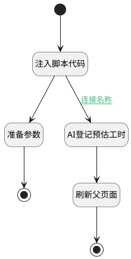

## AI登记预估工时 <!-- {docsify-ignore-all} -->

   

### 处理过程




### 处理步骤说明

#### 开始 :id=Begin<sup class="footnote-symbol"> <font color=gray size=1>[开始]</font></sup>


#### 注入脚本代码 :id=RAWJSCODE4<sup class="footnote-symbol"> <font color=gray size=1>[直接前台代码]</font></sup>


<p class="panel-title"><b>执行代码</b></p>

```javascript

console.info("ai callback");
var answer = null;
var realView = view;
var _entity_tag = view.context._entity_tag;
if (realView.model.appDataEntityId && realView.model.appDataEntityId.endsWith("ai_agent_assignment")) {
    realView = view.parentView;
}
if (!_entity_tag) {
    _entity_tag = realView.model.appDataEntityId ? realView.model.appDataEntityId.split('.').at(-1) : "";
}
if (_entity_tag) {
    uiLogic.default._entity_tag = _entity_tag;
}
//var formController = realView.getController("form");
var wl_name = "";
if (uiLogic.default.data && uiLogic.default.data.messages &&
     uiLogic.default.data.messages.length > 0) {
    const lastAns = uiLogic.default.data.messages[uiLogic.default.data.messages.length - 1];
    answer = lastAns.realcontent;
    if(uiLogic.default.data.aiChat && 
        uiLogic.default.data.aiChat.appendCurData &&
        uiLogic.default.data.aiChat.appendCurData.title) {
        wl_name = uiLogic.default.data.aiChat.appendCurData.title;
    }
}
else if (uiLogic.default.msg) {
    answer = uiLogic.default.msg.realcontent;
    if(uiLogic.default.topic && uiLogic.default.topic.aiChat && 
        uiLogic.default.topic.aiChat.appendCurData &&
        uiLogic.default.topic.aiChat.appendCurData.title) {
        wl_name = uiLogic.default.topic.aiChat.appendCurData.title;
    }
}

uiLogic.list = [];
uiLogic.resultcnt = 0;

if (answer && typeof answer == 'string') {
    var ret = ibiz.util.jsonUtil.parseJson(answer);
    if (ret.success && ret.data) {
        if (ret.data_type == 'jsonarray' && _entity_tag) {
            const principal_id = realView.context[_entity_tag];
            const register_date = new Date();   
            ret.data.forEach(entity => {
                entity.principal_id = principal_id;
                entity.register_date = register_date;
                entity.principal_type= _entity_tag.toUpperCase();
                entity.name = wl_name;
                entity.category="ESTIMATED_WORKLOAD"
                uiLogic.list.push(entity);
                uiLogic.resultcnt = uiLogic.resultcnt+1;
            });
        }

    }

}

```

#### AI登记预估工时 :id=DEACTION_01<sup class="footnote-symbol"> <font color=gray size=1>[实体行为]</font></sup>


调用实体 [工时(WORKLOAD)](module/Base/workload.md) 行为 [Create](module/Base/workload#行为) ，行为参数为`list`

#### 准备参数 :id=PREPAREJSPARAM_01<sup class="footnote-symbol"> <font color=gray size=1>[准备参数]</font></sup>


1. 将`预估工时登记未成功` 设置给  `result.content`

#### 刷新父页面 :id=RAWJSCODE_02<sup class="footnote-symbol"> <font color=gray size=1>[直接前台代码]</font></sup>


<p class="panel-title"><b>执行代码</b></p>

```javascript
view.parentView.call("Refresh");
ibiz.message.success('预估工时登记成功');
uiLogic.result = {content: "预估工时登记成功"};
```

#### 结束 :id=END_02<sup class="footnote-symbol"> <font color=gray size=1>[结束]</font></sup>


#### 结束 :id=END_01<sup class="footnote-symbol"> <font color=gray size=1>[结束]</font></sup>


### 连接条件说明
#### 连接名称 :id=RAWJSCODE4-DEACTION_01

```resultcnt(resultcnt)``` GT ```0```


### 实体逻辑参数

|    中文名   |    代码名    |  数据类型      |备注 |
| --------| --------| --------  | --------   |
|list|list|数据对象列表||
|result|result|数据对象||
|传入变量(<i class="fa fa-check"/></i>)|Default|数据对象||
|resultcnt|resultcnt|简单数据||
