## 自定义导出 <!-- {docsify-ignore-all} -->

   

### 处理过程

```plantuml
@startuml
hide footbox
<style>
root {
  HyperlinkColor #42b983
}
</style>

hide empty description
state "开始" as Begin <<start>> [[$./custom_export#begin {开始}]]
state "注入脚本代码" as RAWJSCODE1  [[$./custom_export#rawjscode1 {注入脚本代码}]]
state "视图部件调用" as VIEWCTRLINVOKE1  [[$./custom_export#viewctrlinvoke1 {视图部件调用}]]
state "结束" as END1 <<end>> [[$./custom_export#end1 {结束}]]
state "准备参数" as PREPAREJSPARAM1  [[$./custom_export#preparejsparam1 {准备参数}]]


Begin --> PREPAREJSPARAM1
PREPAREJSPARAM1 --> RAWJSCODE1
RAWJSCODE1 --> VIEWCTRLINVOKE1
VIEWCTRLINVOKE1 --> END1


@enduml
```




### 处理步骤说明

#### 开始 :id=Begin<sup class="footnote-symbol"> <font color=gray size=1>[开始]</font></sup>


#### 结束 :id=END1<sup class="footnote-symbol"> <font color=gray size=1>[结束]</font></sup>


#### 准备参数 :id=PREPAREJSPARAM1<sup class="footnote-symbol"> <font color=gray size=1>[准备参数]</font></sup>


1. 将`0` 设置给  `params.startPage`
2. 将`0` 设置给  `params.endPage`

#### 注入脚本代码 :id=RAWJSCODE1<sup class="footnote-symbol"> <font color=gray size=1>[直接前台代码]</font></sup>


<p class="panel-title"><b>执行代码</b></p>

```javascript
console.log('测试');
console.log(view);
let myMap = view.ctx.controllersMap;
const lastKey = [...myMap.keys()].pop();
const lastValue = myMap.get(lastKey);
uiLogic.grid = lastValue.layoutPanel.panelItems.grid.control;
console.log(uiLogic.grid);
```

#### 视图部件调用 :id=VIEWCTRLINVOKE1<sup class="footnote-symbol"> <font color=gray size=1>[视图部件调用]</font></sup>


调用`grid(表格)`的方法`exportData`，参数为`params`


### 实体逻辑参数

|    中文名   |    代码名    |  数据类型      |备注 |
| --------| --------| --------  | --------   |
|表格|grid|部件对象||
|params|params|数据对象||
|传入变量(<i class="fa fa-check"/></i>)|Default|数据对象||
|当前视图对象|view|当前视图对象||
