## 打开产品主视图 <!-- {docsify-ignore-all} -->

   调用实体行为，打开产品主视图

### 处理过程

```plantuml
@startuml
hide footbox
<style>
root {
  HyperlinkColor #42b983
}
</style>

hide empty description
state "开始" as Begin <<start>> [[$./open_product_main_view#begin {开始}]]
state "界面行为" as DEUIACTION1  [[$./open_product_main_view#deuiaction1 {界面行为}]]


Begin --> DEUIACTION1


@enduml
```

### 处理步骤说明

#### 开始 :id=Begin [开始]

#### 界面行为 :id=DEUIACTION1 [实体界面行为调用]

调用实体 [工时(WORKLOAD)](module/Base/workload.md) 界面行为 [打开产品主视图](module/Base/workload#界面行为) ，行为参数为`Default(传入变量)`

### 实体逻辑参数

|    中文名   |    代码名    |  数据类型      |备注 |
| --------| --------| --------  | --------   |
|传入变量(<i class="fa fa-check"/></i>)|Default|数据对象||
