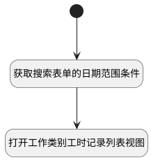

## 打开工作类别工时记录列表视图 <!-- {docsify-ignore-all} -->

   获取搜索表单时间范围条件，并打开工时记录列表

### 处理过程




### 处理步骤说明

#### 开始 :id=Begin<sup class="footnote-symbol"> <font color=gray size=1>[开始]</font></sup>


#### 获取搜索表单的日期范围条件 :id=RAWJSCODE1<sup class="footnote-symbol"> <font color=gray size=1>[直接前台代码]</font></sup>


<p class="panel-title"><b>执行代码</b></p>

```javascript
var n_register_date_gtandeq = view.layoutPanel.panelItems.searchform.control.data.n_register_date_gtandeq;
var n_register_date_ltandeq = view.layoutPanel.panelItems.searchform.control.data.n_register_date_ltandeq;
var n_category_eq = view.layoutPanel.panelItems.searchform.control.data.n_category_eq;
uiLogic.default.n_register_date_gtandeq=n_register_date_gtandeq;
uiLogic.default.n_register_date_ltandeq=n_register_date_ltandeq;
uiLogic.default.n_category_eq=n_category_eq;
```

#### 打开工作类别工时记录列表视图 :id=DEUIACTION1<sup class="footnote-symbol"> <font color=gray size=1>[实体界面行为调用]</font></sup>


调用实体 [工时(WORKLOAD)](module/Base/workload.md) 界面行为 [打开工作类别工时记录](module/Base/workload#界面行为) ，行为参数为`Default(传入变量)`


### 实体逻辑参数

|    中文名   |    代码名    |  数据类型      |备注 |
| --------| --------| --------  | --------   |
|传入变量(<i class="fa fa-check"/></i>)|Default|数据对象||
