## 计算分组信息 <!-- {docsify-ignore-all} -->

   

### 处理过程

```plantuml
@startuml
hide empty description
<style>
root {
  HyperlinkColor #42b983
}
</style>

hide empty description
state "开始" as Begin <<start>> [[$./calc_group_data#begin {"开始"}]]
state "结束" as END1 <<end>> [[$./calc_group_data#end1 {"结束"}]]
state "转换参数" as RAWSFCODE1  [[$./calc_group_data#rawsfcode1 {"转换参数"}]]


Begin --> RAWSFCODE1
RAWSFCODE1 --> END1


@enduml
```




### 处理步骤说明

#### 开始 :id=Begin<sup class="footnote-symbol"> <font color=gray size=1>[开始]</font></sup>


*- N/A*
#### 结束 :id=END1<sup class="footnote-symbol"> <font color=gray size=1>[结束]</font></sup>


返回 `group_data`

#### 转换参数 :id=RAWSFCODE1<sup class="footnote-symbol"> <font color=gray size=1>[直接后台代码]</font></sup>


<p class="panel-title"><b>执行代码[JavaScript]</b></p>

```javascript
var _default = logic.getParam('Default');
var groupdata = logic.getParam('group_data');
if( _default.get("group")!=null){
    groupdata.set("groupname", _default.codeitem("group").text);
    groupdata.set("groupcodename", _default.get("group"));
}
if( _default.get("id")!=null){
    var appportletid = "plmweb.";
    var appportletcodename = "uxbireport__"+_default.get("id").replace(".", "__");
    appportletid = appportletid + appportletcodename;
    groupdata.set("psappportletid",appportletid.toLowerCase());
    groupdata.set("codename",appportletcodename.toLowerCase());
    groupdata.set("psappportletname",_default.get("name"));
    _default.set("ctrl_id",appportletid.toLowerCase());
}

```


### 实体逻辑参数

|    中文名   |    代码名    |  数据类型    |  实体   |备注 |
| --------| --------| -------- | -------- | --------   |
|传入变量(<i class="fa fa-check"/></i>)|Default|数据对象|[效能报表(INSIGHT_REPORT)](module/Insight/insight_report.md)||
|group_data|group_data|数据对象|[效能报表(INSIGHT_REPORT)](module/Insight/insight_report.md)||
