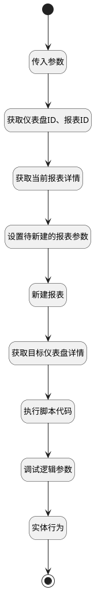

## 复制报表 <!-- {docsify-ignore-all} -->

   

### 处理过程




### 处理步骤说明

#### 开始 :id=Begin<sup class="footnote-symbol"> <font color=gray size=1>[开始]</font></sup>


*- N/A*
#### 结束 :id=END1<sup class="footnote-symbol"> <font color=gray size=1>[结束]</font></sup>


*- N/A*

#### 传入参数 :id=DEBUGPARAM1<sup class="footnote-symbol"> <font color=gray size=1>[调试逻辑参数]</font></sup>


> [!NOTE|label:调试信息|icon:fa fa-bug]
> 调试输出参数`Default(传入变量)`的详细信息


#### 获取仪表盘ID、报表ID :id=PREPAREPARAM1<sup class="footnote-symbol"> <font color=gray size=1>[准备参数]</font></sup>


1. 将`Default(传入变量).srfactionparam` 绑定给  `srfactionparam`
2. 将`srfactionparam.0` 绑定给  `form_data(表单数据)`
3. 将`Default(传入变量).ID(标识)` 设置给  `cur_report(当前报表).ID(标识)`
4. 将`form_data(表单数据).choosed_board` 设置给  `target_board(目标报表).DYNADASHBOARDID(动态数据看板标识)`

#### 获取当前报表详情 :id=DEACTION2<sup class="footnote-symbol"> <font color=gray size=1>[实体行为]</font></sup>


调用实体 [效能报表(INSIGHT_REPORT)](module/Insight/insight_report.md) 行为 [Get](module/Insight/insight_report#行为) ，行为参数为`cur_report(当前报表)`

#### 获取目标仪表盘详情 :id=DEACTION1<sup class="footnote-symbol"> <font color=gray size=1>[实体行为]</font></sup>


调用实体 [动态数据看板(DYNADASHBOARD)](module/Base/dyna_dashboard.md) 行为 [Get](module/Base/dyna_dashboard#行为) ，行为参数为`target_board(目标报表)`

#### 执行脚本代码 :id=RAWSFCODE1<sup class="footnote-symbol"> <font color=gray size=1>[直接后台代码]</font></sup>


<p class="panel-title"><b>执行代码[JavaScript]</b></p>

```javascript
var target_board = logic.getParam("target_board");
var new_report = logic.getParam("new_report");
var strModel = target_board.get("model");
var modeljO = JSON.parse(strModel);
var modeljArray = modeljO.model;
var bireportids = [];
var replaceIds = {};
//获取新建报表ID数据，同步生成仪表盘的模型数据
var portletId = ("plmweb.uxbireport__") + (new_report.get("id").toLowerCase());
var portletCodeName = ("uxbireport__") + (new_report.get("id").toLowerCase());
var new_board_report = {};
new_board_report.i = portletCodeName;
new_board_report.portletId = portletId;
new_board_report.portletCodeName = portletCodeName;


```

#### 调试逻辑参数 :id=DEBUGPARAM2<sup class="footnote-symbol"> <font color=gray size=1>[调试逻辑参数]</font></sup>


> [!NOTE|label:调试信息|icon:fa fa-bug]
> 调试输出参数`target_board(目标报表)`的详细信息


#### 实体行为 :id=DEACTION4<sup class="footnote-symbol"> <font color=gray size=1>[实体行为]</font></sup>


调用实体 [动态数据看板(DYNADASHBOARD)](module/Base/dyna_dashboard.md) 行为 [Update](module/Base/dyna_dashboard#行为) ，行为参数为`target_board(目标报表)`

#### 设置待新建的报表参数 :id=PREPAREPARAM2<sup class="footnote-symbol"> <font color=gray size=1>[准备参数]</font></sup>


1. 将`cur_report(当前报表).NAME(名称)` 设置给  `new_report(新报表).NAME(名称)`
2. 将`cur_report(当前报表).TEMPLATE_MODEL(模板模型)` 设置给  `new_report(新报表).TEMPLATE_MODEL(模板模型)`
3. 将`cur_report(当前报表).CHART_TYPE(图表类型)` 设置给  `new_report(新报表).CHART_TYPE(图表类型)`
4. 将`cur_report(当前报表).DESC(描述)` 设置给  `new_report(新报表).DESC(描述)`
5. 将`cur_report(当前报表).GROUP(组别)` 设置给  `new_report(新报表).GROUP(组别)`
6. 将`form_data(表单数据).target_view_id` 设置给  `new_report(新报表).VIEW_ID(视图标识)`

#### 新建报表 :id=DEACTION3<sup class="footnote-symbol"> <font color=gray size=1>[实体行为]</font></sup>


调用实体 [效能报表(INSIGHT_REPORT)](module/Insight/insight_report.md) 行为 [Create](module/Insight/insight_report#行为) ，行为参数为`new_report(新报表)`


### 实体逻辑参数

|    中文名   |    代码名    |  数据类型    |  实体   |备注 |
| --------| --------| -------- | -------- | --------   |
|传入变量(<i class="fa fa-check"/></i>)|Default|数据对象|[效能报表(INSIGHT_REPORT)](module/Insight/insight_report.md)||
|当前报表|cur_report|数据对象|[效能报表(INSIGHT_REPORT)](module/Insight/insight_report.md)||
|表单数据|form_data|数据对象|[效能报表(INSIGHT_REPORT)](module/Insight/insight_report.md)||
|新报表|new_report|数据对象|[效能报表(INSIGHT_REPORT)](module/Insight/insight_report.md)||
|srfactionparam|srfactionparam|数据对象列表|||
|目标报表|target_board|数据对象|[动态数据看板(DYNADASHBOARD)](module/Base/dyna_dashboard.md)||
