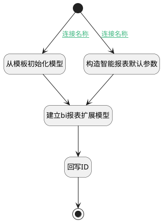

## 建立报表扩展模型 <!-- {docsify-ignore-all} -->

   建立报表扩展模型

### 处理过程




### 处理步骤说明

#### 开始 :id=Begin<sup class="footnote-symbol"> <font color=gray size=1>[开始]</font></sup>


*- N/A*
#### 从模板初始化模型 :id=RAWSFCODE1<sup class="footnote-symbol"> <font color=gray size=1>[直接后台代码]</font></sup>


<p class="panel-title"><b>执行代码[JavaScript]</b></p>

```javascript
var _default = logic.getParam("default");
var bireport = logic.getParam("bireport");
var templateModel = _default.get("template_model");
if(templateModel != null){
    bireport.from(templateModel);
    bireport.reset("pssysbireportid");
    bireport.reset("codename");
}
```

#### 构造智能报表默认参数 :id=PREPAREPARAM1<sup class="footnote-symbol"> <font color=gray size=1>[准备参数]</font></sup>


1. 将`1` 设置给  `bireport(智能报表).VALIDFLAG(启用)`
2. 将`BIScheme` 设置给  `bireport(智能报表).PSSYSBISCHEMEID(智能报表体系)`
3. 将`BIScheme.work_item` 设置给  `bireport(智能报表).PSSYSBICUBEID(智能报表立方体)`
4. 将`Default(传入变量).NAME(名称)` 设置给  `bireport(智能报表).PSSYSBIREPORTNAME(智能报表名称)`

#### 建立bi报表扩展模型 :id=DEACTION1<sup class="footnote-symbol"> <font color=gray size=1>[实体行为]</font></sup>


调用实体 [智能报表(PSSYSBIREPORT)](module/extension/PSSysBIReport.md) 行为 [Create](module/extension/PSSysBIReport#行为) ，行为参数为`bireport(智能报表)`

将执行结果返回给参数`bireport(智能报表)`

#### 结束 :id=END1<sup class="footnote-symbol"> <font color=gray size=1>[结束]</font></sup>


返回 `Default(传入变量)`

#### 回写ID :id=PREPAREPARAM2<sup class="footnote-symbol"> <font color=gray size=1>[准备参数]</font></sup>


1. 将`bireport(智能报表).PSSYSBIREPORTID(智能报表标识)` 设置给  `Default(传入变量).ID(标识)`


### 连接条件说明
#### 连接名称 :id=Begin-PREPAREPARAM1

`Default(传入变量).TEMPLATE_MODEL(模板模型)` ISNULL
#### 连接名称 :id=Begin-RAWSFCODE1

`Default(传入变量).TEMPLATE_MODEL(模板模型)` ISNOTNULL


### 实体逻辑参数

|    中文名   |    代码名    |  数据类型    |  实体   |备注 |
| --------| --------| -------- | -------- | --------   |
|传入变量(<i class="fa fa-check"/></i>)|Default|数据对象|[效能报表(INSIGHT_REPORT)](module/Insight/insight_report.md)||
|智能报表|bireport|数据对象|[智能报表(PSSYSBIREPORT)](module/extension/PSSysBIReport.md)||
