## 移除报表扩展模型 <!-- {docsify-ignore-all} -->

   移除报表扩展模型

### 处理过程

```plantuml
@startuml
hide empty description
<style>
root {
  HyperlinkColor #42b983
}
</style>

hide empty description
state "开始" as Begin <<start>> [[$./remove_bi_report#begin {"开始"}]]
state "设置id" as PREPAREPARAM1  [[$./remove_bi_report#prepareparam1 {"设置id"}]]
state "结束" as END1 <<end>> [[$./remove_bi_report#end1 {"结束"}]]
state "实体行为" as DEACTION1  [[$./remove_bi_report#deaction1 {"实体行为"}]]


Begin --> PREPAREPARAM1
PREPAREPARAM1 --> DEACTION1
DEACTION1 --> END1


@enduml
```

### 处理步骤说明

#### 开始 :id=Begin [开始]

*- N/A*
#### 设置id :id=PREPAREPARAM1 [准备参数]

1. 将`Default(传入变量).ID(标识)` 设置给  `bi_report(智能报表).PSSYSBIREPORTID(智能报表标识)`

#### 结束 :id=END1 [结束]

*- N/A*

#### 实体行为 :id=DEACTION1 [实体行为]

调用实体 [智能报表(PSSYSBIREPORT)](module/extension/PSSysBIReport.md) 行为 [Remove](module/extension/PSSysBIReport#行为) ，行为参数为`bi_report(智能报表)`

### 实体逻辑参数

|    中文名   |    代码名    |  数据类型    |  实体   |备注 |
| --------| --------| -------- | -------- | --------   |
|传入变量(<i class="fa fa-check"/></i>)|Default|数据对象|[效能报表(INSIGHT_REPORT)](module/Insight/insight_report.md)||
|智能报表|bi_report|数据对象|[智能报表(PSSYSBIREPORT)](module/extension/PSSysBIReport.md)||
