## 同步模板模型 <!-- {docsify-ignore-all} -->

   同步模板模型

### 处理过程

```plantuml
@startuml
hide empty description
<style>
root {
  HyperlinkColor #42b983
}
</style>

hide empty description
state "开始" as Begin <<start>> [[$./sync_model#begin {"开始"}]]
state "结束" as END1 <<end>> [[$./sync_model#end1 {"结束"}]]
state "准备report标识" as PREPAREPARAM1  [[$./sync_model#prepareparam1 {"准备report标识"}]]
state "获取bireport" as DEACTION1  [[$./sync_model#deaction1 {"获取bireport"}]]
state "dump模型" as RAWSFCODE1  [[$./sync_model#rawsfcode1 {"dump模型"}]]
state "更新模型属性" as DEACTION2  [[$./sync_model#deaction2 {"更新模型属性"}]]


Begin --> PREPAREPARAM1
PREPAREPARAM1 --> DEACTION1
DEACTION1 --> RAWSFCODE1
RAWSFCODE1 --> DEACTION2
DEACTION2 --> END1


@enduml
```




### 处理步骤说明

#### 开始 :id=Begin<sup class="footnote-symbol"> <font color=gray size=1>[开始]</font></sup>


*- N/A*
#### 结束 :id=END1<sup class="footnote-symbol"> <font color=gray size=1>[结束]</font></sup>


*- N/A*

#### 准备report标识 :id=PREPAREPARAM1<sup class="footnote-symbol"> <font color=gray size=1>[准备参数]</font></sup>


1. 将`Default(传入变量).ID(标识)` 设置给  `bireport.PSSYSBIREPORTID(智能报表标识)`

#### 获取bireport :id=DEACTION1<sup class="footnote-symbol"> <font color=gray size=1>[实体行为]</font></sup>


调用实体 [智能报表(PSSYSBIREPORT)](module/extension/PSSysBIReport.md) 行为 [Get](module/extension/PSSysBIReport#行为) ，行为参数为`bireport`

将执行结果返回给参数`bireport`

#### dump模型 :id=RAWSFCODE1<sup class="footnote-symbol"> <font color=gray size=1>[直接后台代码]</font></sup>


<p class="panel-title"><b>执行代码[JavaScript]</b></p>

```javascript
var bireport = logic.getParam("bireport");
var _default = logic.getParam("default");
_default.set("template_model",bireport.dump());
```

#### 更新模型属性 :id=DEACTION2<sup class="footnote-symbol"> <font color=gray size=1>[实体行为]</font></sup>


调用实体 [效能报表(INSIGHT_REPORT)](module/Insight/insight_report.md) 行为 [Update](module/Insight/insight_report#行为) ，行为参数为`Default(传入变量)`


### 实体逻辑参数

|    中文名   |    代码名    |  数据类型    |  实体   |备注 |
| --------| --------| -------- | -------- | --------   |
|传入变量(<i class="fa fa-check"/></i>)|Default|数据对象|[效能报表(INSIGHT_REPORT)](module/Insight/insight_report.md)||
|bireport|bireport|数据对象|[智能报表(PSSYSBIREPORT)](module/extension/PSSysBIReport.md)||
