## 使用此模板 <!-- {docsify-ignore-all} -->

   使用此模板

### 处理过程

```plantuml
@startuml
hide empty description
<style>
root {
  HyperlinkColor #42b983
}
</style>

hide empty description
state "开始" as Begin <<start>> [[$./use_cur_template#begin {"开始"}]]
state "结束" as END1 <<end>> [[$./use_cur_template#end1 {"结束"}]]
state "准备参数" as PREPAREPARAM1  [[$./use_cur_template#prepareparam1 {"准备参数"}]]
state "创建看板" as DEACTION2  [[$./use_cur_template#deaction2 {"创建看板"}]]
state "生成报表" as RAWSFCODE1  [[$./use_cur_template#rawsfcode1 {"生成报表"}]]


Begin --> PREPAREPARAM1
PREPAREPARAM1 --> DEACTION2
DEACTION2 --> END1


@enduml
```




### 处理步骤说明

#### 开始 :id=Begin<sup class="footnote-symbol"> <font color=gray size=1>[开始]</font></sup>


*- N/A*
#### 结束 :id=END1<sup class="footnote-symbol"> <font color=gray size=1>[结束]</font></sup>


返回 `new_report(新报表)`

#### 准备参数 :id=PREPAREPARAM1<sup class="footnote-symbol"> <font color=gray size=1>[准备参数]</font></sup>


1. 将`Default(传入变量).NAME(名称)` 设置给  `new_report(新报表).NAME(名称)`
2. 将`Default(传入变量).CTRL_ID(报表部件标识)` 设置给  `new_report(新报表).CTRL_ID(报表部件标识)`
3. 将`Default(传入变量).CHART_TYPE(图表类型)` 设置给  `new_report(新报表).CHART_TYPE(图表类型)`
4. 将`Default(传入变量).GROUP(组别)` 设置给  `new_report(新报表).GROUP(组别)`
5. 将`Default(传入变量).GROUP_DATA(分组数据)` 设置给  `new_report(新报表).GROUP_DATA(分组数据)`
6. 将`Default(传入变量).DESC(描述)` 设置给  `new_report(新报表).DESC(描述)`
7. 将`Default(传入变量).TEMPLATE_MODEL(模板模型)` 设置给  `new_report(新报表).TEMPLATE_MODEL(模板模型)`
8. 将`Default(传入变量).insight_view_id` 设置给  `new_report(新报表).VIEW_ID(视图标识)`

#### 创建看板 :id=DEACTION2<sup class="footnote-symbol"> <font color=gray size=1>[实体行为]</font></sup>


调用实体 [效能报表(INSIGHT_REPORT)](module/Insight/insight_report.md) 行为 [Create](module/Insight/insight_report#行为) ，行为参数为`new_report(新报表)`

#### 生成报表 :id=RAWSFCODE1<sup class="footnote-symbol"> <font color=gray size=1>[直接后台代码]</font></sup>


<p class="panel-title"><b>执行代码[JavaScript]</b></p>

```javascript
var new_board = logic.getParam("new_board");
var strModel = new_board.get("model");
var modeljO = JSON.parse(strModel);
var modeljArray = modeljO.model;
var bireportids = [];
var replaceIds ={};
for(var i=0; i<modeljArray.length; i++){
  var reportModel = modeljArray[i];
  var portletid = reportModel.i;
  var bireportid = portletid.substring(12).replace("__",".");
  bireportids.push(bireportid);
}
var reportSearchContext = sys.filter("insight_report");
var templReports = reportSearchContext.in("id",bireportids.join(",")).pageable(0,1000).select();
for(var i=0; i<templReports.length; i++){
    var bireport = templReports.get(i);
    var orginId = bireport.get("id");
    bireport.reset("id");
    bireport.set("view_id",new_board.get("owner_id"));
    bireport.set("is_system",0);
    bireport.create();
    replaceIds[orginId.replace(".","__")] = bireport.get("id").replace(".","__");
}
for(var key in replaceIds){
 strModel = strModel.replace(key,replaceIds[key]);
}
//类似forEach遍历
new_board.set("model",strModel);
```


### 实体逻辑参数

|    中文名   |    代码名    |  数据类型    |  实体   |备注 |
| --------| --------| -------- | -------- | --------   |
|传入变量(<i class="fa fa-check"/></i>)|Default|数据对象|[效能报表(INSIGHT_REPORT)](module/Insight/insight_report.md)||
|新报表|new_report|数据对象|[效能报表(INSIGHT_REPORT)](module/Insight/insight_report.md)||
|报表|report|数据对象|[效能报表(INSIGHT_REPORT)](module/Insight/insight_report.md)||
