## 编辑类别或分组 <!-- {docsify-ignore-all} -->

   调用树节点修改方法，编辑当前树节点的类别或分组

### 处理过程

```plantuml
@startuml
hide footbox
<style>
root {
  HyperlinkColor #42b983
}
</style>

hide empty description
state "开始" as Begin <<start>> [[$./edit_section_or_category#begin {开始}]]
state "获取类别ID" as PREPAREJSPARAM1  [[$./edit_section_or_category#preparejsparam1 {获取类别ID}]]
state "树节点更新" as VIEWCTRLINVOKE1  [[$./edit_section_or_category#viewctrlinvoke1 {树节点更新}]]


Begin --> PREPAREJSPARAM1
PREPAREJSPARAM1 --> VIEWCTRLINVOKE1


@enduml
```

### 处理步骤说明

#### 开始 :id=Begin [开始]

#### 获取类别ID :id=PREPAREJSPARAM1 [准备参数]

1. 将`Default(传入变量)._id` 设置给  `node_param(节点参数).nodeKey`

#### 树节点更新 :id=VIEWCTRLINVOKE1 [视图部件调用]

调用`treeexpbar_tree(树部件)`的方法`updateTreeNode`，参数为`node_param(节点参数)`

### 实体逻辑参数

|    中文名   |    代码名    |  数据类型      |备注 |
| --------| --------| --------  | --------   |
|树部件|treeexpbar_tree|部件对象||
|传入变量(<i class="fa fa-check"/></i>)|Default|数据对象||
|节点参数|node_param|数据对象||
