## 导出表格 <!-- {docsify-ignore-all} -->

   

### 处理过程

```plantuml
@startuml
hide footbox
<style>
root {
  HyperlinkColor #42b983
}
</style>

hide empty description
state "开始" as Begin <<start>> [[$./export_excel#begin {开始}]]
state "获取表格" as PREPAREJSPARAM1  [[$./export_excel#preparejsparam1 {获取表格}]]
state "整合表格数据并导出" as RAWJSCODE1  [[$./export_excel#rawjscode1 {整合表格数据并导出}]]


Begin --> PREPAREJSPARAM1
PREPAREJSPARAM1 --> RAWJSCODE1


@enduml
```




### 处理步骤说明

#### 开始 :id=Begin<sup class="footnote-symbol"> <font color=gray size=1>[开始]</font></sup>


#### 获取表格 :id=PREPAREJSPARAM1<sup class="footnote-symbol"> <font color=gray size=1>[准备参数]</font></sup>


1. 将`view(视图).layoutPanel.panelItems.field_text_dynamic.grid` 设置给  `biGrid(bi表格)`
2. 将`biGrid(bi表格).chartController` 设置给  `grid(表格)`

#### 整合表格数据并导出 :id=RAWJSCODE1<sup class="footnote-symbol"> <font color=gray size=1>[直接前台代码]</font></sup>


<p class="panel-title"><b>执行代码</b></p>

```javascript
if (uiLogic.grid) {
    uiLogic.grid.exportData({params: {}});
}
```


### 实体逻辑参数

|    中文名   |    代码名    |  数据类型      |备注 |
| --------| --------| --------  | --------   |
|bi表格|biGrid|数据对象||
|表格|grid|数据对象||
|传入变量(<i class="fa fa-check"/></i>)|Default|数据对象||
|视图|view|当前视图对象||
