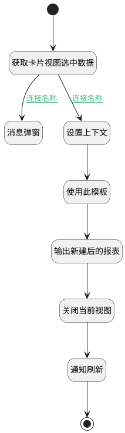

## 使用此模板 <!-- {docsify-ignore-all} -->

   

### 处理过程




### 处理步骤说明

#### 开始 :id=Begin<sup class="footnote-symbol"> <font color=gray size=1>[开始]</font></sup>


#### 获取卡片视图选中数据 :id=RAWJSCODE4<sup class="footnote-symbol"> <font color=gray size=1>[直接前台代码]</font></sup>


<p class="panel-title"><b>执行代码</b></p>

```javascript
const controllersMap = view.ctx.controllersMap;
const card_view = controllersMap.get("insight_reportcustom_card_view");
const selectdata = card_view.layoutPanel.panelItems.dataview.control.state.selectedData;
uiLogic.selecteddata = selectdata;
console.log(selectdata);

```

#### 设置上下文 :id=RAWJSCODE1<sup class="footnote-symbol"> <font color=gray size=1>[直接前台代码]</font></sup>


<p class="panel-title"><b>执行代码</b></p>

```javascript
if(uiLogic.selecteddata && uiLogic.selecteddata.length >0){
    uiLogic.ctx.dynadashboard = uiLogic.selecteddata[0].dynadashboardid;
    uiLogic.dyna_dashboard_info = uiLogic.selecteddata[0];
    uiLogic.dyna_dashboard_info.insight_view_id = uiLogic.ctx.insight_view_id;
}
```

#### 使用此模板 :id=DEACTION1<sup class="footnote-symbol"> <font color=gray size=1>[实体行为]</font></sup>


调用实体 [效能报表(INSIGHT_REPORT)](module/Insight/insight_report.md) 行为 [使用此模板(use_cur_template)](module/Insight/insight_report#行为) ，行为参数为`dyna_dashboard_info(看板数据)`

将执行结果返回给参数`new_report(新建报表)`

#### 输出新建后的报表 :id=DEBUGPARAM1<sup class="footnote-symbol"> <font color=gray size=1>[调试逻辑参数]</font></sup>


> [!NOTE|label:调试信息|icon:fa fa-bug]
> 调试输出参数`新建报表`的详细信息

#### 关闭当前视图 :id=RAWJSCODE2<sup class="footnote-symbol"> <font color=gray size=1>[直接前台代码]</font></sup>


<p class="panel-title"><b>执行代码</b></p>

```javascript
view.state.isLoading = false;
view.closeView();
```

#### 结束 :id=END1<sup class="footnote-symbol"> <font color=gray size=1>[结束]</font></sup>


#### 消息弹窗 :id=MSGBOX1<sup class="footnote-symbol"> <font color=gray size=1>[消息弹窗]</font></sup>


#### 通知刷新 :id=RAWJSCODE3<sup class="footnote-symbol"> <font color=gray size=1>[直接前台代码]</font></sup>


<p class="panel-title"><b>执行代码</b></p>

```javascript
ibiz.mc.command.create.send({ srfdecodename: 'insight_report'})
```

### 连接条件说明
#### 连接名称 :id=RAWJSCODE4-RAWJSCODE1

```selecteddata(选中数据)``` ISNOTNULL
#### 连接名称 :id=RAWJSCODE4-MSGBOX1

```selecteddata(选中数据)``` ISNULL


### 实体逻辑参数

|    中文名   |    代码名    |  数据类型      |备注 |
| --------| --------| --------  | --------   |
|看板数据|dyna_dashboard_info|数据对象||
|新建报表|new_report|数据对象||
|传入变量(<i class="fa fa-check"/></i>)|Default|数据对象||
|当前视图对象|view|当前视图对象||
|选中数据|selecteddata|数据对象列表||
|上下文|ctx|导航视图参数绑定参数||
