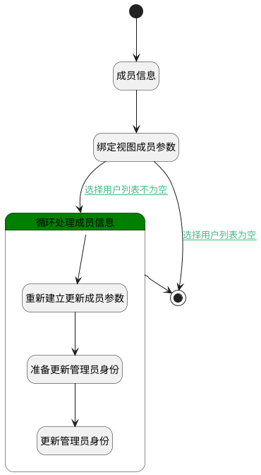

## 变更管理员角色 <!-- {docsify-ignore-all} -->

   批量变更管理员角色身份（role_id）

### 处理过程




### 处理步骤说明

#### 开始 :id=Begin<sup class="footnote-symbol"> <font color=gray size=1>[开始]</font></sup>


*- N/A*
#### 成员信息 :id=DEBUGPARAM1<sup class="footnote-symbol"> <font color=gray size=1>[调试逻辑参数]</font></sup>


> [!NOTE|label:调试信息|icon:fa fa-bug]
> 调试输出参数`Default(传入变量)`的详细信息


#### 绑定视图成员参数 :id=BINDPARAM1<sup class="footnote-symbol"> <font color=gray size=1>[绑定参数]</font></sup>


绑定参数`Default(传入变量)` 到 `insight_view_member(用户列表)`
#### 循环处理成员信息 :id=LOOPSUBCALL1<sup class="footnote-symbol"> <font color=gray size=1>[循环子调用]</font></sup>


循环参数`insight_view_member(用户列表)`，子循环参数使用`for_temp_obj(循环临时变量)`
#### 重新建立更新成员参数 :id=RENEWPARAM1<sup class="footnote-symbol"> <font color=gray size=1>[重新建立参数]</font></sup>


重建参数```update_member_info(更新成员对象)```
#### 准备更新管理员身份 :id=PREPAREPARAM1<sup class="footnote-symbol"> <font color=gray size=1>[准备参数]</font></sup>


1. 将`for_temp_obj(循环临时变量).ID(标识)` 设置给  `update_member_info(更新成员对象).USER_ID(用户标识)`
2. 将`admin` 设置给  `update_member_info(更新成员对象).ROLE_ID(角色)`
3. 将`Default(传入变量).ID(标识)` 设置给  `update_member_info(更新成员对象).OWNER_ID(效能标识)`

#### 更新管理员身份 :id=DEACTION1<sup class="footnote-symbol"> <font color=gray size=1>[实体行为]</font></sup>


调用实体 [效能成员(INSIGHT_MEMBER)](module/Insight/insight_member.md) 行为 [Save](module/Insight/insight_member#行为) ，行为参数为`update_member_info(更新成员对象)`

#### 结束 :id=END1<sup class="footnote-symbol"> <font color=gray size=1>[结束]</font></sup>


*- N/A*


### 连接条件说明
#### 选择用户列表为空 :id=BINDPARAM1-END1

`insight_view_member(用户列表).size` EQ `0`
#### 选择用户列表不为空 :id=BINDPARAM1-LOOPSUBCALL1

`insight_view_member(用户列表).size` GT `0`


### 实体逻辑参数

|    中文名   |    代码名    |  数据类型    |  实体   |备注 |
| --------| --------| -------- | -------- | --------   |
|传入变量(<i class="fa fa-check"/></i>)|Default|数据对象|[效能视图(INSIGHT_VIEW)](module/Insight/insight_view.md)||
|循环临时变量|for_temp_obj|数据对象|[企业用户(USER)](module/Base/user.md)||
|用户列表|insight_view_member|数据对象列表|[企业用户(USER)](module/Base/user.md)||
|更新成员对象|update_member_info|数据对象|[效能成员(INSIGHT_MEMBER)](module/Insight/insight_member.md)||
