## 判断是否需要选择模板 <!-- {docsify-ignore-all} -->

   

### 处理过程

```plantuml
@startuml
hide empty description
<style>
root {
  HyperlinkColor #42b983
}
</style>

hide empty description
state "开始" as Begin <<start>> [[$./recognize_choose_template#begin {"开始"}]]
state "结束" as END1 <<end>> [[$./recognize_choose_template#end1 {"结束"}]]
state "准备参数" as PREPAREPARAM1  [[$./recognize_choose_template#prepareparam1 {"准备参数"}]]
state "实体数据集" as DEDATASET1  [[$./recognize_choose_template#dedataset1 {"实体数据集"}]]
state "调试逻辑参数" as DEBUGPARAM1  [[$./recognize_choose_template#debugparam1 {"调试逻辑参数"}]]
state "返回无仪表盘" as PREPAREPARAM2  [[$./recognize_choose_template#prepareparam2 {"返回无仪表盘"}]]
state "准备参数" as PREPAREPARAM3  [[$./recognize_choose_template#prepareparam3 {"准备参数"}]]
state "结束" as END2 <<end>> [[$./recognize_choose_template#end2 {"结束"}]]


Begin --> PREPAREPARAM1
PREPAREPARAM1 --> DEDATASET1
DEDATASET1 --> DEBUGPARAM1
DEBUGPARAM1 --> PREPAREPARAM2 : [[$./recognize_choose_template#debugparam1-prepareparam2{连接名称} 连接名称]]
PREPAREPARAM2 --> END1
DEBUGPARAM1 --> PREPAREPARAM3 : [[$./recognize_choose_template#debugparam1-prepareparam3{连接名称} 连接名称]]
PREPAREPARAM3 --> END2


@enduml
```

### 处理步骤说明

#### 开始 :id=Begin [开始]

*- N/A*
#### 结束 :id=END1 [结束]

返回 `Default(传入变量)`

#### 准备参数 :id=PREPAREPARAM1 [准备参数]

1. 将`Default(传入变量).ID(标识)` 设置给  `filter(过滤器).N_OWNER_ID_EQ`

#### 实体数据集 :id=DEDATASET1 [实体数据集]

调用实体 [动态数据看板(DYNADASHBOARD)](module/Base/dyna_dashboard.md) 数据集合 [正常数据(normal)](module/Base/dyna_dashboard#数据集合) ，查询参数为`filter(过滤器)`

将执行结果返回给参数`board_page(看板分页数据)`

#### 调试逻辑参数 :id=DEBUGPARAM1 [调试逻辑参数]

> [!NOTE|label:调试信息|icon:fa fa-bug]
> 调试输出参数`board_page(看板分页数据)`的详细信息

#### 返回无仪表盘 :id=PREPAREPARAM2 [准备参数]

1. 将`true` 设置给  `Default(传入变量).no_board`

#### 准备参数 :id=PREPAREPARAM3 [准备参数]

1. 将`board_page(看板分页数据).0` 绑定给  `first_board(第一条仪表盘)`

#### 结束 :id=END2 [结束]

返回 `first_board(第一条仪表盘)`

### 连接条件说明
#### 连接名称 :id=DEBUGPARAM1-PREPAREPARAM2

`board_page(看板分页数据).size` EQ `0`
#### 连接名称 :id=DEBUGPARAM1-PREPAREPARAM3

`board_page(看板分页数据).size` NOTEQ `0`

### 实体逻辑参数

|    中文名   |    代码名    |  数据类型    |  实体   |备注 |
| --------| --------| -------- | -------- | --------   |
|传入变量(<i class="fa fa-check"/></i>)|Default|数据对象|[效能视图(INSIGHT_VIEW)](module/Insight/insight_view.md)||
|看板分页数据|board_page|分页查询|||
|过滤器|filter|过滤器|||
|第一条仪表盘|first_board|数据对象|[动态数据看板(DYNADASHBOARD)](module/Base/dyna_dashboard.md)||
