## 恢复 <!-- {docsify-ignore-all} -->

   恢复

### 处理过程

```plantuml
@startuml
hide empty description
<style>
root {
  HyperlinkColor #42b983
}
</style>

hide empty description
state "开始" as Begin <<start>> [[$./recover#begin {"开始"}]]
state "设置视图参数信息" as PREPAREPARAM1  [[$./recover#prepareparam1 {"设置视图参数信息"}]]
state "更新视图参数" as DEACTION1  [[$./recover#deaction1 {"更新视图参数"}]]
state "结束" as END1 <<end>> [[$./recover#end1 {"结束"}]]


Begin --> PREPAREPARAM1
PREPAREPARAM1 --> DEACTION1
DEACTION1 --> END1


@enduml
```

### 处理步骤说明

#### 开始 :id=Begin [开始]

*- N/A*
#### 设置视图参数信息 :id=PREPAREPARAM1 [准备参数]

1. 将`Default(传入变量).ID(标识)` 设置给  `update_obj(更新对象).ID(标识)`
2. 将`0` 设置给  `update_obj(更新对象).IS_DELETED(是否已删除)`

#### 更新视图参数 :id=DEACTION1 [实体行为]

调用实体 [效能视图(INSIGHT_VIEW)](module/Insight/insight_view.md) 行为 [Update](module/Insight/insight_view#行为) ，行为参数为`update_obj(更新对象)`

#### 结束 :id=END1 [结束]

*- N/A*

### 实体逻辑参数

|    中文名   |    代码名    |  数据类型    |  实体   |备注 |
| --------| --------| -------- | -------- | --------   |
|传入变量(<i class="fa fa-check"/></i>)|Default|数据对象|[效能视图(INSIGHT_VIEW)](module/Insight/insight_view.md)||
|更新对象|update_obj|数据对象|[效能视图(INSIGHT_VIEW)](module/Insight/insight_view.md)||
