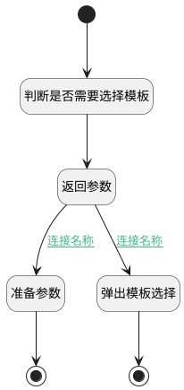

## 选择模板 <!-- {docsify-ignore-all} -->

   选择模板

### 处理过程




### 处理步骤说明

#### 开始 :id=Begin<sup class="footnote-symbol"> <font color=gray size=1>[开始]</font></sup>


#### 结束 :id=END1<sup class="footnote-symbol"> <font color=gray size=1>[结束]</font></sup>


#### 判断是否需要选择模板 :id=DEACTION1<sup class="footnote-symbol"> <font color=gray size=1>[实体行为]</font></sup>


调用实体 [效能视图(INSIGHT_VIEW)](module/Insight/insight_view.md) 行为 [判断是否需要选择模板(recognize_choose_template)](module/Insight/insight_view#行为) ，行为参数为`Default(传入变量)`

将执行结果返回给参数`insight_view_info(效能度量详情)`

#### 返回参数 :id=DEBUGPARAM2<sup class="footnote-symbol"> <font color=gray size=1>[调试逻辑参数]</font></sup>


> [!NOTE|label:调试信息|icon:fa fa-bug]
> 调试输出参数`效能度量详情`的详细信息

#### 弹出模板选择 :id=DEUIACTION1<sup class="footnote-symbol"> <font color=gray size=1>[实体界面行为调用]</font></sup>


调用实体 [效能视图(INSIGHT_VIEW)](module/Insight/insight_view.md) 界面行为 [打开模板选择](module/Insight/insight_view#界面行为) ，行为参数为`insight_view_info(效能度量详情)`

#### 准备参数 :id=PREPAREJSPARAM1<sup class="footnote-symbol"> <font color=gray size=1>[准备参数]</font></sup>


1. 将`insight_view_info(效能度量详情).dyna_dashboard_id` 设置给  `ctx(上下文).srfdynadashboardid`
2. 将`insight_view_info(效能度量详情).dyna_dashboard_id` 设置给  `ctx(上下文).dyna_dashboard`

#### 结束 :id=END2<sup class="footnote-symbol"> <font color=gray size=1>[结束]</font></sup>


### 连接条件说明
#### 连接名称 :id=DEBUGPARAM2-DEUIACTION1

```insight_view_info(效能度量详情).no_board``` EQ ```true```
#### 连接名称 :id=DEBUGPARAM2-PREPAREJSPARAM1

```insight_view_info(效能度量详情).no_board``` ISNULL


### 实体逻辑参数

|    中文名   |    代码名    |  数据类型      |备注 |
| --------| --------| --------  | --------   |
|传入变量(<i class="fa fa-check"/></i>)|Default|数据对象||
|效能度量详情|insight_view_info|数据对象||
|当前视图对象|view|当前视图对象||
|视图参数|params|||
|上下文|ctx|导航视图参数绑定参数||
