## 产品标识(PRODUCT_ID) <!-- {docsify-ignore-all} -->

   

### 默认规则 :id=Default

```plantuml
@startuml
hide empty description
<style>
root {
  HyperlinkColor #42b983
}
</style>

state "start" as start  <<start>>
state "end" as end <<end>>
state "默认字符串长度" as f117c1631c620ed59efed95731d44f0f [[$./Product_id#af117c1631c620ed59efed95731d44f0f {"默认字符串长度"}]]


start --> f117c1631c620ed59efed95731d44f0f 
f117c1631c620ed59efed95731d44f0f --> end 


@enduml
```

#### 条件说明

##### 默认字符串长度 :id=af117c1631c620ed59efed95731d44f0f

*关键条件*

`PRODUCT_ID(产品标识)` 属性长度在区间 `(0 , 100]` 内

> [!ATTENTION|label:规则信息|icon:fa fa-warning]
> 内容长度必须小于等于[100]

