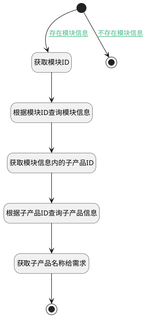

## 需求模块获取子产品 <!-- {docsify-ignore-all} -->

   

### 处理过程

### 处理步骤说明

#### 开始 :id=Begin [开始]

*- N/A*
#### 获取模块ID :id=PREPAREPARAM1 [准备参数]

1. 将`Default(传入变量).SUITE(模块)` 设置给  `category(模块).ID(标识)`

#### 根据模块ID查询模块信息 :id=DEACTION1 [实体行为]

调用实体 [类别(CATEGORY)](module/Base/Category.md) 行为 [Get](module/Base/Category#行为) ，行为参数为`category(模块)`

将执行结果返回给参数`category(模块)`

#### 获取模块信息内的子产品ID :id=PREPAREPARAM2 [准备参数]

1. 将`category(模块).SECTION_ID(分组标识)` 设置给  `section(子产品).ID(标识)`

#### 根据子产品ID查询子产品信息 :id=DEACTION2 [实体行为]

调用实体 [分组(SECTION)](module/Base/Section.md) 行为 [Get](module/Base/Section#行为) ，行为参数为`section(子产品)`

#### 获取子产品名称给需求 :id=PREPAREPARAM3 [准备参数]

1. 将`section(子产品).NAME(名称)` 设置给  `Default(传入变量).SECTION_NAME(子产品名称)`

#### 结束 :id=END2 [结束]

返回 `Default(传入变量)`

#### 结束 :id=END1 [结束]

*- N/A*

### 连接条件说明
#### 不存在模块信息 :id=Begin-END1

`Default(传入变量).SUITE(模块)` ISNULL
#### 存在模块信息 :id=Begin-PREPAREPARAM1

`Default(传入变量).SUITE(模块)` ISNOTNULL

### 实体逻辑参数

|    中文名   |    代码名    |  数据类型    |  实体   |备注 |
| --------| --------| -------- | -------- | --------   |
|传入变量(<i class="fa fa-check"/></i>)|Default|数据对象|[需求(IDEA)](module/ProdMgmt/Idea.md)||
|模块|category|数据对象|[类别(CATEGORY)](module/Base/Category.md)||
|子产品|section|数据对象|[分组(SECTION)](module/Base/Section.md)||
