## 状态变更附加逻辑 <!-- {docsify-ignore-all} -->

   

### 处理过程

```plantuml
@startuml
hide empty description
<style>
root {
  HyperlinkColor #42b983
}
</style>

hide empty description
state "开始" as Begin <<start>> [[$./state_onchange#begin {"开始"}]]
state "实体通知" as DENOTIFY1  [[$./state_onchange#denotify1 {"实体通知"}]]
state "准备参数" as PREPAREPARAM1  [[$./state_onchange#prepareparam1 {"准备参数"}]]
state "创建流转历史" as DEACTION1  [[$./state_onchange#deaction1 {"创建流转历史"}]]
state "结束" as END1 <<end>> [[$./state_onchange#end1 {"结束"}]]


Begin --> DENOTIFY1 : [[$./state_onchange#begin-denotify1{连接名称} 连接名称]]
DENOTIFY1 --> PREPAREPARAM1
PREPAREPARAM1 --> DEACTION1
DEACTION1 --> END1


@enduml
```

### 处理步骤说明

#### 开始 :id=Begin [开始]

*- N/A*
#### 实体通知 :id=DENOTIFY1 [实体通知]

调用实体 [需求(IDEA)](module/ProdMgmt/Idea.md) 通知 [状态变更通知(state_onchage_notify)](module/ProdMgmt/Idea/notify/state_onchage_notify) ，参数为`Default(传入变量)`
#### 准备参数 :id=PREPAREPARAM1 [准备参数]

1. 将`last.STATE(状态)` 设置给  `transition_history(流转对象).FROM_STATE(源状态)`
2. 将`Default(传入变量).STATE(状态)` 设置给  `transition_history(流转对象).TO_STATE(目标状态)`
3. 将`Default(传入变量).UPDATE_TIME(更新时间)` 设置给  `transition_history(流转对象).CREATE_TIME(建立时间)`
4. 将`Default(传入变量).ID(标识)` 设置给  `transition_history(流转对象).OWNER_ID(所属数据标识)`
5. 将`product` 设置给  `transition_history(流转对象).OWNER_TYPE(所属数据对象)`
6. 将`idea` 设置给  `transition_history(流转对象).OWNER_SUBTYPE(所属对象子类型)`

#### 创建流转历史 :id=DEACTION1 [实体行为]

调用实体 [流转记录(TRANSITION_HISTORY)](module/ProjMgmt/Transition_history.md) 行为 [Create](module/ProjMgmt/Transition_history#行为) ，行为参数为`transition_history(流转对象)`

#### 结束 :id=END1 [结束]

*- N/A*

### 连接条件说明
#### 连接名称 :id=Begin-DENOTIFY1

`Default(传入变量).STATE(状态)` ISNOTNULL

### 实体逻辑参数

|    中文名   |    代码名    |  数据类型    |  实体   |备注 |
| --------| --------| -------- | -------- | --------   |
|传入变量(<i class="fa fa-check"/></i>)|Default|数据对象|[需求(IDEA)](module/ProdMgmt/Idea.md)||
|last|last|数据对象|[需求(IDEA)](module/ProdMgmt/Idea.md)||
|流转对象|transition_history|数据对象|[流转记录(TRANSITION_HISTORY)](module/ProjMgmt/Transition_history.md)||
