## 需求排期 <!-- {docsify-ignore-all} -->

   

### 处理过程

```plantuml
@startuml
hide footbox
<style>
root {
  HyperlinkColor #42b983
}
</style>

hide empty description
state "开始" as Begin <<start>> [[$./IDEA_RE_PLAN#begin {开始}]]
state "实体行为" as DEACTION1  [[$./IDEA_RE_PLAN#deaction1 {实体行为}]]
state "结束" as END1 <<end>> [[$./IDEA_RE_PLAN#end1 {结束}]]
state "准备参数" as PREPAREJSPARAM1  [[$./IDEA_RE_PLAN#preparejsparam1 {准备参数}]]
state "最后参数" as DEBUGPARAM3  [[$./IDEA_RE_PLAN#debugparam3 {最后参数}]]
state "表单数据" as DEBUGPARAM4  [[$./IDEA_RE_PLAN#debugparam4 {表单数据}]]
state "调试逻辑参数" as DEBUGPARAM2  [[$./IDEA_RE_PLAN#debugparam2 {调试逻辑参数}]]


Begin --> DEBUGPARAM2
DEBUGPARAM2 --> PREPAREJSPARAM1
PREPAREJSPARAM1 --> DEBUGPARAM4
DEBUGPARAM4 --> DEBUGPARAM3
DEBUGPARAM3 --> DEACTION1
DEACTION1 --> END1


@enduml
```

### 处理步骤说明

#### 开始 :id=Begin

#### 实体行为 :id=DEACTION1

调用实体 [需求(IDEA)](module/ProdMgmt/Idea.md) 行为 [需求排期(idea_re_plan)](module/ProdMgmt/Idea#行为) ，行为参数为`Default(传入变量)`

#### 结束 :id=END1

#### 准备参数 :id=PREPAREJSPARAM1

1. 将`form(表单部件对象).data` 绑定给  `FORMDATA(表单数据)`
2. 将`FORMDATA(表单数据).formitem` 设置给  `Default(传入变量)`

#### 最后参数 :id=DEBUGPARAM3

> [!NOTE|label:调试信息|icon:fa fa-bug]
> 调试输出参数`传入变量`的详细信息

#### 表单数据 :id=DEBUGPARAM4

> [!NOTE|label:调试信息|icon:fa fa-bug]
> 调试输出参数`表单数据`的详细信息

#### 调试逻辑参数 :id=DEBUGPARAM2

> [!NOTE|label:调试信息|icon:fa fa-bug]
> 调试输出参数`表单部件对象`的详细信息

### 实体逻辑参数

|    中文名   |    代码名    |  数据类型      |备注 |
| --------| --------| --------  | --------   |
|表单部件对象|form|部件对象||
|表单数据|FORMDATA|数据对象||
|传入变量(<i class="fa fa-check"/></i>)|Default|数据对象||
