## 编号(IDENTIFIER) <!-- {docsify-ignore-all} -->

   

### 编号范围 :id=DEFValueRule

```plantuml
@startuml
hide empty description
<style>
root {
  HyperlinkColor #42b983
}
</style>

state "start" as start  <<start>>
state "end" as end <<end>>
state "[常规条件] 等于(=) (1)" as 73d723b40420b7c5ee386258173c6c38 [[$./Identifier#a73d723b40420b7c5ee386258173c6c38 {"[常规条件] 等于(=) (1)"}]]
state "[常规条件] 不等于(<>) 当前时间" as a547a33e6286977d1d169f66dd0d466d [[$./Identifier#aa547a33e6286977d1d169f66dd0d466d {"[常规条件] 不等于(<>) 当前时间"}]]
state "[条件组]AND" as 99425cc5dfca5c842672adbee018329f [[$./Identifier#a99425cc5dfca5c842672adbee018329f {"[条件组]AND"}]] {
state " " as 99425cc5dfca5c842672adbee018329f_entry  <<entryPoint>>
state "[常规条件] 等于(=) 数据对象属性 (FIELD)" as 73218ee1bbc4a85fa5360981d4b9164b [[$./Identifier#a73218ee1bbc4a85fa5360981d4b9164b {"[常规条件] 等于(=) 数据对象属性 (FIELD)"}]]
state "[条件组]OR" as 70c12bd2d39aa5e7e1f7b0e162977be1 [[$./Identifier#a70c12bd2d39aa5e7e1f7b0e162977be1 {"[条件组]OR"}]] {
state " " as 70c12bd2d39aa5e7e1f7b0e162977be1_entry  <<entryPoint>>
state "[!][常规条件] 等于(=) (4)" as 50f40bc67eee833f955f55a93f04362d [[$./Identifier#a50f40bc67eee833f955f55a93f04362d {"[!][常规条件] 等于(=) (4)"}]]
state "[条件组]AND" as ff8a07aa9c6bb1024d2b39602c1dfddf [[$./Identifier#aff8a07aa9c6bb1024d2b39602c1dfddf {"[条件组]AND"}]] {
state " " as ff8a07aa9c6bb1024d2b39602c1dfddf_entry  <<entryPoint>>
state "[常规条件] 等于(=) (11)" as 46ba9d815a3860a8e94a3afa7320ceb0 [[$./Identifier#a46ba9d815a3860a8e94a3afa7320ceb0 {"[常规条件] 等于(=) (11)"}]]
state "[条件组]OR" as 053418fe5266a286a42b5305891aa6e8 [[$./Identifier#a053418fe5266a286a42b5305891aa6e8 {"[条件组]OR"}]] {
state " " as 053418fe5266a286a42b5305891aa6e8_entry  <<entryPoint>>
state "[常规条件] 等于(=) (FIELD2)" as 1791febe8bcef13d690216e45f9a7e92 [[$./Identifier#a1791febe8bcef13d690216e45f9a7e92 {"[常规条件] 等于(=) (FIELD2)"}]]
state "[常规条件] 等于(=) (13)" as a16c7bd6fe1751c3f174a231edd1a1fb [[$./Identifier#aa16c7bd6fe1751c3f174a231edd1a1fb {"[常规条件] 等于(=) (13)"}]]
state " " as 053418fe5266a286a42b5305891aa6e8_exit  <<exitPoint>>
}
state " " as ff8a07aa9c6bb1024d2b39602c1dfddf_exit  <<exitPoint>>
}
state "[常规条件] 等于(=) (5)" as 7c7144c12a7837a18cd7f86bfb4d9e2f [[$./Identifier#a7c7144c12a7837a18cd7f86bfb4d9e2f {"[常规条件] 等于(=) (5)"}]]
state " " as 70c12bd2d39aa5e7e1f7b0e162977be1_exit  <<exitPoint>>
}
state " " as 99425cc5dfca5c842672adbee018329f_exit  <<exitPoint>>
}
state "[数值范围] IDENTIFIER" as 293a4ea8cd30f4b04fa9ccd99cf0479d [[$./Identifier#a293a4ea8cd30f4b04fa9ccd99cf0479d {"[数值范围] IDENTIFIER"}]]
state "[!][条件组]OR" as 895533532165833e0a300beac4131956 [[$./Identifier#a895533532165833e0a300beac4131956 {"[!][条件组]OR"}]] {
state " " as 895533532165833e0a300beac4131956_entry  <<entryPoint>>
state "[常规条件] 等于(=) (6)" as 305eb74082a6d2865cffbf4e9b70db3c [[$./Identifier#a305eb74082a6d2865cffbf4e9b70db3c {"[常规条件] 等于(=) (6)"}]]
state "[常规条件] 等于(=) (7)" as 7efb6ade1192f28d6e0e57c25772f9e7 [[$./Identifier#a7efb6ade1192f28d6e0e57c25772f9e7 {"[常规条件] 等于(=) (7)"}]]
state "[正则式]" as 16d3f770a078c22d9c722402b4328818 [[$./Identifier#a16d3f770a078c22d9c722402b4328818 {"[正则式]"}]]
state " " as 895533532165833e0a300beac4131956_exit  <<exitPoint>>
}
state "[条件组]AND" as d06e8989334743552dfbb9dcb0a6e66a [[$./Identifier#ad06e8989334743552dfbb9dcb0a6e66a {"[条件组]AND"}]] {
state " " as d06e8989334743552dfbb9dcb0a6e66a_entry  <<entryPoint>>
state "[值清单] (1|2|3|4)" as 03a71fcd5808874df52ec5c3864311e3 [[$./Identifier#a03a71fcd5808874df52ec5c3864311e3 {"[值清单] (1|2|3|4)"}]]
state "[常规条件] 等于(=) (8)" as a3951cbfebe52741c13182d37933e1a2 [[$./Identifier#aa3951cbfebe52741c13182d37933e1a2 {"[常规条件] 等于(=) (8)"}]]
state " " as d06e8989334743552dfbb9dcb0a6e66a_exit  <<exitPoint>>
}
state "[常规条件] 等于(=) (9)" as 5198d2a43633ed8a7dd6f2030a02e2fa [[$./Identifier#a5198d2a43633ed8a7dd6f2030a02e2fa {"[常规条件] 等于(=) (9)"}]]
state "[条件组]AND" as c21d89e24b47942d0779faba38cbd9d3 [[$./Identifier#ac21d89e24b47942d0779faba38cbd9d3 {"[条件组]AND"}]] {
state " " as c21d89e24b47942d0779faba38cbd9d3_entry  <<entryPoint>>
state "[字符长度] IDENTIFIER 小于50" as 96e4bfe518c7b0df3cd5d2e938d23b95 [[$./Identifier#a96e4bfe518c7b0df3cd5d2e938d23b95 {"[字符长度] IDENTIFIER 小于50"}]]
state "[查询计数] 查询[DEFAULT]记录数" as 4ca8f30901757449048c7a6c1b30fbf2 [[$./Identifier#a4ca8f30901757449048c7a6c1b30fbf2 {"[查询计数] 查询[DEFAULT]记录数"}]]
state "[数据集范围]实体[IDEA]数据集合[DEFAULT]" as 5364bcca96daaaef12a519a1d2c89bd3 [[$./Identifier#a5364bcca96daaaef12a519a1d2c89bd3 {"[数据集范围]实体[IDEA]数据集合[DEFAULT]"}]]
state "[系统值规则]" as 01be67e69c74eff852a10b90a29ca8fc [[$./Identifier#a01be67e69c74eff852a10b90a29ca8fc {"[系统值规则]"}]]
state " " as c21d89e24b47942d0779faba38cbd9d3_exit  <<exitPoint>>
}
state "[值递归检查] 引用实体IDEA递归检查" as 91a958589d0a2c24ac5fc52d3d78fa65 [[$./Identifier#a91a958589d0a2c24ac5fc52d3d78fa65 {"[值递归检查] 引用实体IDEA递归检查"}]]


start --> 73d723b40420b7c5ee386258173c6c38 
73d723b40420b7c5ee386258173c6c38 --> a547a33e6286977d1d169f66dd0d466d  :yes
73d723b40420b7c5ee386258173c6c38 -[#red]-> end  : no

a547a33e6286977d1d169f66dd0d466d --> 99425cc5dfca5c842672adbee018329f_entry  :yes
a547a33e6286977d1d169f66dd0d466d -[#red]-> end  : no

99425cc5dfca5c842672adbee018329f_exit --> 293a4ea8cd30f4b04fa9ccd99cf0479d 
99425cc5dfca5c842672adbee018329f_entry --> 73218ee1bbc4a85fa5360981d4b9164b 
73218ee1bbc4a85fa5360981d4b9164b --> 70c12bd2d39aa5e7e1f7b0e162977be1_entry  :yes
73218ee1bbc4a85fa5360981d4b9164b -[#red]-> end  : no

70c12bd2d39aa5e7e1f7b0e162977be1_entry --> 50f40bc67eee833f955f55a93f04362d 
50f40bc67eee833f955f55a93f04362d --> 70c12bd2d39aa5e7e1f7b0e162977be1_exit  : yes
50f40bc67eee833f955f55a93f04362d -[#red]-> ff8a07aa9c6bb1024d2b39602c1dfddf_entry  : no

ff8a07aa9c6bb1024d2b39602c1dfddf_exit --> 70c12bd2d39aa5e7e1f7b0e162977be1_exit 

ff8a07aa9c6bb1024d2b39602c1dfddf_entry --> 46ba9d815a3860a8e94a3afa7320ceb0 
46ba9d815a3860a8e94a3afa7320ceb0 --> 053418fe5266a286a42b5305891aa6e8_entry  :yes
46ba9d815a3860a8e94a3afa7320ceb0 -[#red]-> 7c7144c12a7837a18cd7f86bfb4d9e2f  : no

053418fe5266a286a42b5305891aa6e8_entry --> 1791febe8bcef13d690216e45f9a7e92 
1791febe8bcef13d690216e45f9a7e92 --> 053418fe5266a286a42b5305891aa6e8_exit  : yes
1791febe8bcef13d690216e45f9a7e92 -[#red]-> end  : no

a16c7bd6fe1751c3f174a231edd1a1fb --> 053418fe5266a286a42b5305891aa6e8_exit  : yes
a16c7bd6fe1751c3f174a231edd1a1fb -[#red]-> end  : no
053418fe5266a286a42b5305891aa6e8_exit --> ff8a07aa9c6bb1024d2b39602c1dfddf_exit 
7c7144c12a7837a18cd7f86bfb4d9e2f --> 70c12bd2d39aa5e7e1f7b0e162977be1_exit  : yes
7c7144c12a7837a18cd7f86bfb4d9e2f -[#red]-> end  : no
70c12bd2d39aa5e7e1f7b0e162977be1_exit --> 99425cc5dfca5c842672adbee018329f_exit 
293a4ea8cd30f4b04fa9ccd99cf0479d --> 895533532165833e0a300beac4131956_entry  :yes
293a4ea8cd30f4b04fa9ccd99cf0479d -[#red]-> end  : no

895533532165833e0a300beac4131956_exit --> d06e8989334743552dfbb9dcb0a6e66a_entry 
895533532165833e0a300beac4131956_entry --> 305eb74082a6d2865cffbf4e9b70db3c 
305eb74082a6d2865cffbf4e9b70db3c --> 895533532165833e0a300beac4131956_exit  : yes
305eb74082a6d2865cffbf4e9b70db3c -[#red]-> 7efb6ade1192f28d6e0e57c25772f9e7  : no

7efb6ade1192f28d6e0e57c25772f9e7 --> 895533532165833e0a300beac4131956_exit  : yes
7efb6ade1192f28d6e0e57c25772f9e7 -[#red]-> 16d3f770a078c22d9c722402b4328818  : no

16d3f770a078c22d9c722402b4328818 --> 895533532165833e0a300beac4131956_exit  : yes
16d3f770a078c22d9c722402b4328818 -[#red]-> end  : no
d06e8989334743552dfbb9dcb0a6e66a_exit --> 5198d2a43633ed8a7dd6f2030a02e2fa 
d06e8989334743552dfbb9dcb0a6e66a_entry --> 03a71fcd5808874df52ec5c3864311e3 
03a71fcd5808874df52ec5c3864311e3 --> a3951cbfebe52741c13182d37933e1a2  :yes
03a71fcd5808874df52ec5c3864311e3 -[#red]-> end  : no

a3951cbfebe52741c13182d37933e1a2 --> d06e8989334743552dfbb9dcb0a6e66a_exit  : yes
a3951cbfebe52741c13182d37933e1a2 -[#red]-> end  : no
5198d2a43633ed8a7dd6f2030a02e2fa --> c21d89e24b47942d0779faba38cbd9d3_entry  :yes
5198d2a43633ed8a7dd6f2030a02e2fa -[#red]-> end  : no

c21d89e24b47942d0779faba38cbd9d3_exit --> 91a958589d0a2c24ac5fc52d3d78fa65 
c21d89e24b47942d0779faba38cbd9d3_entry --> 96e4bfe518c7b0df3cd5d2e938d23b95 
96e4bfe518c7b0df3cd5d2e938d23b95 --> 4ca8f30901757449048c7a6c1b30fbf2  :yes
96e4bfe518c7b0df3cd5d2e938d23b95 -[#red]-> end  : no

4ca8f30901757449048c7a6c1b30fbf2 --> 5364bcca96daaaef12a519a1d2c89bd3  :yes
4ca8f30901757449048c7a6c1b30fbf2 -[#red]-> end  : no

5364bcca96daaaef12a519a1d2c89bd3 --> 01be67e69c74eff852a10b90a29ca8fc  :yes
5364bcca96daaaef12a519a1d2c89bd3 -[#red]-> end  : no

01be67e69c74eff852a10b90a29ca8fc --> c21d89e24b47942d0779faba38cbd9d3_exit  : yes
01be67e69c74eff852a10b90a29ca8fc -[#red]-> end  : no
91a958589d0a2c24ac5fc52d3d78fa65 --> end 


@enduml
```

#### 条件说明

##### [常规条件] 等于(=) (5) :id=a7c7144c12a7837a18cd7f86bfb4d9e2f

`IDENTIFIER(编号)` EQ  `直接值 5`

##### [系统值规则] :id=a01be67e69c74eff852a10b90a29ca8fc

`IDENTIFIER(编号)` 使用规则[手机号码](index/sys_value_rule_index#UsrValueRule0104419718)进行校验

> [!ATTENTION|label:规则信息|icon:fa fa-warning]
> 非法手机号

##### [常规条件] 等于(=) (11) :id=a46ba9d815a3860a8e94a3afa7320ceb0

`IDENTIFIER(编号)` EQ  `直接值 11`

##### [常规条件] 等于(=) (6) :id=a305eb74082a6d2865cffbf4e9b70db3c

`IDENTIFIER(编号)` EQ  `直接值 6`

##### [值递归检查] 引用实体IDEA递归检查 :id=a91a958589d0a2c24ac5fc52d3d78fa65

##### [字符长度] IDENTIFIER 小于50 :id=a96e4bfe518c7b0df3cd5d2e938d23b95

`IDENTIFIER(编号)` 属性长度在区间 `(0 , 50]` 内

> [!ATTENTION|label:规则信息|icon:fa fa-warning]
> 内容长度必须大于等于[0]且小于等于[50]

##### [常规条件] 等于(=) (8) :id=aa3951cbfebe52741c13182d37933e1a2

`IDENTIFIER(编号)` EQ  `直接值 8`

##### [常规条件] 不等于(<>) 当前时间 :id=aa547a33e6286977d1d169f66dd0d466d

`IDENTIFIER(编号)` NOTEQ  `当前时间`

##### [数值范围] IDENTIFIER :id=a293a4ea8cd30f4b04fa9ccd99cf0479d

`IDENTIFIER(编号)` 值在区间 `
(1.0 , 100.0]` 内

> [!ATTENTION|label:规则信息|icon:fa fa-warning]
> 数值必须大于[1.0]且小于等于[100.0]

##### [查询计数] 查询[DEFAULT]记录数 :id=a4ca8f30901757449048c7a6c1b30fbf2

查询[数据查询(DEFAULT)]()结果`result` 在区间 `(-∞ , +∞)` 内

> [!ATTENTION|label:规则信息|icon:fa fa-warning]
> 大于0

##### [数据集范围]实体[IDEA]数据集合[DEFAULT] :id=a5364bcca96daaaef12a519a1d2c89bd3

##### [常规条件] 等于(=) (13) :id=aa16c7bd6fe1751c3f174a231edd1a1fb

`IDENTIFIER(编号)` EQ  `直接值 13`

##### [常规条件] 等于(=) (FIELD2) :id=a1791febe8bcef13d690216e45f9a7e92

*关键条件*

`IDENTIFIER(编号)` EQ  `FIELD2`

##### [常规条件] 等于(=) (9) :id=a5198d2a43633ed8a7dd6f2030a02e2fa

`IDENTIFIER(编号)` EQ  `直接值 9`

##### [!][常规条件] 等于(=) (4) :id=a50f40bc67eee833f955f55a93f04362d

*取反*

`IDENTIFIER(编号)` EQ  `直接值 4`

##### [常规条件] 等于(=) (7) :id=a7efb6ade1192f28d6e0e57c25772f9e7

`IDENTIFIER(编号)` EQ  `直接值 7`

##### [正则式] :id=a16d3f770a078c22d9c722402b4328818

`IDENTIFIER(编号)` 符合正则表达式 `^\d+(\.\d+)?`

##### [常规条件] 等于(=) 数据对象属性 (FIELD) :id=a73218ee1bbc4a85fa5360981d4b9164b

`IDENTIFIER(编号)` EQ  `FIELD`

##### [值清单] (1|2|3|4) :id=a03a71fcd5808874df52ec5c3864311e3

`IDENTIFIER(编号)` 值属于 `[1, 2, 3, 4]`

##### [常规条件] 等于(=) (1) :id=a73d723b40420b7c5ee386258173c6c38

`IDENTIFIER(编号)` EQ  `直接值 1`

### 默认规则 :id=Default

```plantuml
@startuml
hide empty description
<style>
root {
  HyperlinkColor #42b983
}
</style>

state "start" as start  <<start>>
state "end" as end <<end>>
state "默认字符串长度" as 217dc099770969d2957520c3154bb37d [[$./Identifier#a217dc099770969d2957520c3154bb37d {"默认字符串长度"}]]


start --> 217dc099770969d2957520c3154bb37d 
217dc099770969d2957520c3154bb37d --> end 


@enduml
```

#### 条件说明

##### 默认字符串长度 :id=a217dc099770969d2957520c3154bb37d

*关键条件*

`IDENTIFIER(编号)` 属性长度在区间 `(0 , 100]` 内

> [!ATTENTION|label:规则信息|icon:fa fa-warning]
> 内容长度必须小于等于[100]

