## 是否归档变更附加逻辑 <!-- {docsify-ignore-all} -->

   

### 处理过程

```plantuml
@startuml
hide empty description
<style>
root {
  HyperlinkColor #42b983
}
</style>

hide empty description
state "开始" as Begin <<start>> [[$./is_archived_onchange#begin {"开始"}]]
state "实体通知" as DENOTIFY1  [[$./is_archived_onchange#denotify1 {"实体通知"}]]
state "结束" as END1 <<end>> [[$./is_archived_onchange#end1 {"结束"}]]


Begin --> DENOTIFY1
DENOTIFY1 --> END1


@enduml
```

### 处理步骤说明

#### 开始 :id=Begin [开始]

*- N/A*
#### 实体通知 :id=DENOTIFY1 [实体通知]

调用实体 [产品(PRODUCT)](module/ProdMgmt/Product.md) 通知 [产品归档/激活通知(archived_nofity)](module/ProdMgmt/Product/notify/archived_nofity) ，参数为`Default(传入变量)`
#### 结束 :id=END1 [结束]

*- N/A*

### 实体逻辑参数

|    中文名   |    代码名    |  数据类型    |  实体   |备注 |
| --------| --------| -------- | -------- | --------   |
|传入变量(<i class="fa fa-check"/></i>)|Default|数据对象|[产品(PRODUCT)](module/ProdMgmt/Product.md)||
