## 新建产品默认临时成员 <!-- {docsify-ignore-all} -->

   

### 处理过程

```plantuml
@startuml
hide footbox
<style>
root {
  HyperlinkColor #42b983
}
</style>

hide empty description
state "开始" as Begin <<start>> [[$./create_default_temp_members#begin {开始}]]
state "获取当前用户数据" as PREPAREJSPARAM1  [[$./create_default_temp_members#preparejsparam1 {获取当前用户数据}]]
state "创建临时数据" as RAWJSCODE1  [[$./create_default_temp_members#rawjscode1 {创建临时数据}]]
state "结束" as END1 <<end>> [[$./create_default_temp_members#end1 {结束}]]


Begin --> PREPAREJSPARAM1
PREPAREJSPARAM1 --> RAWJSCODE1
RAWJSCODE1 --> END1


@enduml
```




### 处理步骤说明

#### 开始 :id=Begin


#### 获取当前用户数据 :id=PREPAREJSPARAM1


1. 将`数据上下文[srfusername] ==> user[name]` 设置给  `user(当前人员).name`
2. 将`admin` 设置给  `user(当前人员).role_id`
3. 将`数据上下文[srfuserid] ==> user[user_id]` 设置给  `user(当前人员).user_id`
4. 将`数据上下文[library] ==> user[library_id]` 设置给  `user(当前人员).library_id`

#### 创建临时数据 :id=RAWJSCODE1


<p class="panel-title"><b>执行代码</b></p>

```javascript
ibiz.hub.getApp(context.srfappid).deService.exec(
    'plmweb.product_member',
    'Create',
    context,
    uiLogic.user,
);
```

#### 结束 :id=END1


### 实体逻辑参数

|    中文名   |    代码名    |  数据类型      |备注 |
| --------| --------| --------  | --------   |
|传入变量(<i class="fa fa-check"/></i>)|Default|数据对象||
|当前人员|user|数据对象||
