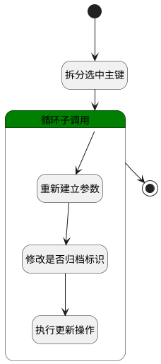

## 归档 <!-- {docsify-ignore-all} -->

   

### 处理过程




### 处理步骤说明

#### 开始 :id=Begin<sup class="footnote-symbol"> <font color=gray size=1>[开始]</font></sup>


*- N/A*
#### 拆分选中主键 :id=RAWSFCODE1<sup class="footnote-symbol"> <font color=gray size=1>[直接后台代码]</font></sup>


<p class="panel-title"><b>执行代码[JavaScript]</b></p>

```groovy
var defaultObj = logic.getParam("default");
var ids = logic.getParam("ids");
var id = defaultObj.get("id");
if(id != null && id != ''){
    if(id.contains(";")){
        var idArray = [];
        idArray = id.split(";");
        for (var i = 0; i < idArray.length; i++) {
            ids.add(idArray[i]);
        }
    } else {
        ids.add(id);
    }
}
```

#### 循环子调用 :id=LOOPSUBCALL1<sup class="footnote-symbol"> <font color=gray size=1>[循环子调用]</font></sup>


循环参数`ids(选中的主键)`，子循环参数使用`id(要更改状态的主键)`
#### 重新建立参数 :id=RENEWPARAM1<sup class="footnote-symbol"> <font color=gray size=1>[重新建立参数]</font></sup>


重建参数```temp_obj(临时变量)```
#### 修改是否归档标识 :id=PREPAREPARAM1<sup class="footnote-symbol"> <font color=gray size=1>[准备参数]</font></sup>


1. 将`1` 设置给  `temp_obj(临时变量).IS_ARCHIVED(是否已归档)`
2. 将`id(要更改状态的主键)` 设置给  `temp_obj(临时变量).ID(标识)`

#### 执行更新操作 :id=DEACTION1<sup class="footnote-symbol"> <font color=gray size=1>[实体行为]</font></sup>


调用实体 [工单(TICKET)](module/ProdMgmt/Ticket.md) 行为 [Update](module/ProdMgmt/Ticket#行为) ，行为参数为`temp_obj(临时变量)`

#### 结束 :id=END1<sup class="footnote-symbol"> <font color=gray size=1>[结束]</font></sup>


*- N/A*


### 实体逻辑参数

|    中文名   |    代码名    |  数据类型    |  实体   |备注 |
| --------| --------| -------- | -------- | --------   |
|传入变量(<i class="fa fa-check"/></i>)|Default|数据对象|[工单(TICKET)](module/ProdMgmt/Ticket.md)||
|要更改状态的主键|id|简单数据|||
|选中的主键|ids|简单数据列表|||
|临时变量|temp_obj|数据对象|[工单(TICKET)](module/ProdMgmt/Ticket.md)||
