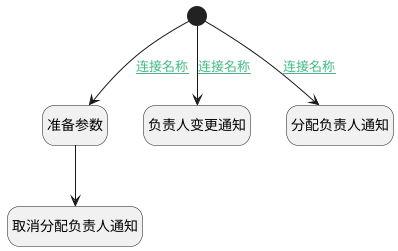

## 负责人变更附加逻辑 <!-- {docsify-ignore-all} -->

   

### 处理过程

### 处理步骤说明

#### 开始 :id=Begin [开始]

*- N/A*
#### 准备参数 :id=PREPAREPARAM1 [准备参数]

1. 将`Default(传入变量).UPDATE_MAN(更新人)` 设置给  `Last(变更前).UPDATE_MAN`

#### 负责人变更通知 :id=DENOTIFY2 [实体通知]

调用实体 [工单(TICKET)](module/ProdMgmt/Ticket.md) 通知 [负责人变更通知(assignee_onchange_notify)](module/ProdMgmt/Ticket/notify/assignee_onchange_notify) ，参数为`Default(传入变量)`
#### 分配负责人通知 :id=DENOTIFY1 [实体通知]

调用实体 [工单(TICKET)](module/ProdMgmt/Ticket.md) 通知 [分配负责人通知(assignee_notify)](module/ProdMgmt/Ticket/notify/assignee_notify) ，参数为`Default(传入变量)`
#### 取消分配负责人通知 :id=DENOTIFY3 [实体通知]

调用实体 [工单(TICKET)](module/ProdMgmt/Ticket.md) 通知 [取消分配负责人通知(assignee_cancel_notify)](module/ProdMgmt/Ticket/notify/assignee_cancel_notify) ，参数为`Last(变更前)`

### 连接条件说明
#### 连接名称 :id=Begin-DENOTIFY1

`Default(传入变量).ASSIGNEE_ID(负责人标识)` ISNOTNULL
#### 连接名称 :id=Begin-DENOTIFY2

`Default(传入变量).ID(标识)` ISNOTNULL
#### 连接名称 :id=Begin-PREPAREPARAM1

`Last(变更前).ASSIGNEE_ID` ISNOTNULL

### 实体逻辑参数

|    中文名   |    代码名    |  数据类型    |  实体   |备注 |
| --------| --------| -------- | -------- | --------   |
|传入变量(<i class="fa fa-check"/></i>)|Default|数据对象|[工单(TICKET)](module/ProdMgmt/Ticket.md)||
|变更前|Last|最后数据变量|||
