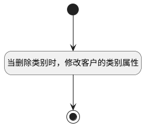

## 删除类别 <!-- {docsify-ignore-all} -->

   当类别删除时修改客户的类别属性

### 处理过程




### 处理步骤说明

#### 开始 :id=Begin<sup class="footnote-symbol"> <font color=gray size=1>[开始]</font></sup>


*- N/A*
#### 结束 :id=END1<sup class="footnote-symbol"> <font color=gray size=1>[结束]</font></sup>


*- N/A*

#### 当删除类别时，修改客户的类别属性 :id=RAWSQLCALL1<sup class="footnote-symbol"> <font color=gray size=1>[直接SQL调用]</font></sup>


<p class="panel-title"><b>执行sql语句</b></p>

```sql
UPDATE customer
SET categories = TRIM(BOTH ',' FROM REPLACE(CONCAT(',', categories, ','), CONCAT(',', ?, ','), ','))
WHERE FIND_IN_SET(?, categories) > 0 ;
```

<p class="panel-title"><b>执行sql参数</b></p>

1. `Default(传入变量).id(标识)`
2. `Default(传入变量).id(标识)`


### 实体逻辑参数

|    中文名   |    代码名    |  数据类型    |  实体   |备注 |
| --------| --------| -------- | -------- | --------   |
|传入变量(<i class="fa fa-check"/></i>)|Default|数据对象|[客户(CUSTOMER)](module/ProdMgmt/customer.md)||
|过滤器|filter|过滤器|||
|排期过滤器|plan_filter|过滤器|||
|排期计划分页数据|product_plan_pages|分页查询|||
