## 填充类别文本 <!-- {docsify-ignore-all} -->

   填充类别对应文本

### 处理过程

```plantuml
@startuml
hide empty description
<style>
root {
  HyperlinkColor #42b983
}
</style>

hide empty description
state "开始" as Begin <<start>> [[$./fill_categories_name#begin {"开始"}]]
state "结束" as END1 <<end>> [[$./fill_categories_name#end1 {"结束"}]]
state "类别转换" as PREPAREPARAM1  [[$./fill_categories_name#prepareparam1 {"类别转换"}]]
state "结束" as END2 <<end>> [[$./fill_categories_name#end2 {"结束"}]]


Begin --> PREPAREPARAM1
PREPAREPARAM1 --> END1
PREPAREPARAM1 -[#red]-> END2


@enduml
```

### 处理步骤说明

#### 开始 :id=Begin [开始]

*- N/A*
#### 结束 :id=END1 [结束]

返回 `Default(传入变量)`

#### 类别转换 :id=PREPAREPARAM1 [准备参数]

1. 将`Default(传入变量).CATEGORIES(类别)` 设置给  `Default(传入变量).CATEGORIES_NAME(类别)`

#### 结束 :id=END2 [结束]

*- N/A*

### 实体逻辑参数

|    中文名   |    代码名    |  数据类型    |  实体   |备注 |
| --------| --------| -------- | -------- | --------   |
|传入变量(<i class="fa fa-check"/></i>)|Default|数据对象|[客户(CUSTOMER)](module/ProdMgmt/customer.md)||
