## 删除客户发送通知 <!-- {docsify-ignore-all} -->

   根据客户标识触发删除客户发送通知

### 处理过程

```plantuml
@startuml
hide empty description
<style>
root {
  HyperlinkColor #42b983
}
</style>

hide empty description
state "开始" as Begin <<start>> [[$./remove_customer_notify#begin {"开始"}]]
state "获取客户信息" as DEACTION1  [[$./remove_customer_notify#deaction1 {"获取客户信息"}]]
state "获取当前操作人" as PREPAREPARAM1  [[$./remove_customer_notify#prepareparam1 {"获取当前操作人"}]]
state "获取操作时间" as RAWSFCODE1  [[$./remove_customer_notify#rawsfcode1 {"获取操作时间"}]]
state "删除客户通知" as DENOTIFY1  [[$./remove_customer_notify#denotify1 {"删除客户通知"}]]


Begin --> DEACTION1
DEACTION1 --> PREPAREPARAM1
PREPAREPARAM1 --> RAWSFCODE1
RAWSFCODE1 --> DENOTIFY1


@enduml
```




### 处理步骤说明

#### 开始 :id=Begin<sup class="footnote-symbol"> <font color=gray size=1>[开始]</font></sup>


*- N/A*
#### 获取客户信息 :id=DEACTION1<sup class="footnote-symbol"> <font color=gray size=1>[实体行为]</font></sup>


调用实体 [客户(CUSTOMER)](module/ProdMgmt/customer.md) 行为 [Get](module/ProdMgmt/customer#行为) ，行为参数为`Default(传入变量)`

将执行结果返回给参数`Default(传入变量)`

#### 获取当前操作人 :id=PREPAREPARAM1<sup class="footnote-symbol"> <font color=gray size=1>[准备参数]</font></sup>


1. 将`用户全局对象.srfpersonid` 设置给  `Default(传入变量).UPDATE_MAN(更新人)`

#### 获取操作时间 :id=RAWSFCODE1<sup class="footnote-symbol"> <font color=gray size=1>[直接后台代码]</font></sup>


<p class="panel-title"><b>执行代码[JavaScript]</b></p>

```javascript
var defaultObj = logic.getParam("default");
defaultObj.set("update_time", new Date());
```

#### 删除客户通知 :id=DENOTIFY1<sup class="footnote-symbol"> <font color=gray size=1>[实体通知]</font></sup>


调用实体 [客户(CUSTOMER)](module/ProdMgmt/customer.md) 通知 [删除客户通知(remove_notify)](module/ProdMgmt/customer/notify/remove_notify) ，参数为`Default(传入变量)`


### 实体逻辑参数

|    中文名   |    代码名    |  数据类型    |  实体   |备注 |
| --------| --------| -------- | -------- | --------   |
|传入变量(<i class="fa fa-check"/></i>)|Default|数据对象|[客户(CUSTOMER)](module/ProdMgmt/customer.md)||
