## 返回 <!-- {docsify-ignore-all} -->

   查看客户统计信息后，返回主表单按钮使用

### 处理过程

```plantuml
@startuml
hide footbox
<style>
root {
  HyperlinkColor #42b983
}
</style>

hide empty description
state "开始" as Begin <<start>> [[$./back#begin {开始}]]
state "绑定表单" as PREPAREJSPARAM2  [[$./back#preparejsparam2 {绑定表单}]]
state "获取父视图对象" as PREPAREJSPARAM1  [[$./back#preparejsparam1 {获取父视图对象}]]
state "表单刷新" as VIEWCTRLINVOKE1  [[$./back#viewctrlinvoke1 {表单刷新}]]
state "切换显示组件" as RAWJSCODE1  [[$./back#rawjscode1 {切换显示组件}]]


Begin --> PREPAREJSPARAM1
PREPAREJSPARAM1 --> PREPAREJSPARAM2
PREPAREJSPARAM2 --> RAWJSCODE1
RAWJSCODE1 --> VIEWCTRLINVOKE1


@enduml
```




### 处理步骤说明

#### 开始 :id=Begin<sup class="footnote-symbol"> <font color=gray size=1>[开始]</font></sup>


#### 获取父视图对象 :id=PREPAREJSPARAM1<sup class="footnote-symbol"> <font color=gray size=1>[准备参数]</font></sup>


1. 将`view(当前视图对象).parentView` 设置给  `parentView`

#### 绑定表单 :id=PREPAREJSPARAM2<sup class="footnote-symbol"> <font color=gray size=1>[准备参数]</font></sup>


1. 将`parentView.layoutPanel.panelItems.form.control` 设置给  `form(表单)`

#### 切换显示组件 :id=RAWJSCODE1<sup class="footnote-symbol"> <font color=gray size=1>[直接前台代码]</font></sup>


<p class="panel-title"><b>执行代码</b></p>

```javascript
uiLogic.parentview.ctx.controllersMap.get("form").details.grouppanel8.state.visible=true;
uiLogic.parentview.ctx.controllersMap.get("form").details.grouppanel9.state.visible=false;

```

#### 表单刷新 :id=VIEWCTRLINVOKE1<sup class="footnote-symbol"> <font color=gray size=1>[视图部件调用]</font></sup>


调用`form(表单)`的方法`load`，参数为`Default(传入变量)`


### 实体逻辑参数

|    中文名   |    代码名    |  数据类型      |备注 |
| --------| --------| --------  | --------   |
|parentView|parentView|数据对象||
|传入变量(<i class="fa fa-check"/></i>)|Default|数据对象||
|表单|form|部件对象||
|当前视图对象|view|当前视图对象||
