## 获取客户分数(初始化使用) <!-- {docsify-ignore-all} -->

   获取客户分数以及百分比（初始化使用）

### 处理过程

```plantuml
@startuml
hide footbox
<style>
root {
  HyperlinkColor #42b983
}
</style>

hide empty description
state "开始" as Begin <<start>> [[$./get_customer_score_2#begin {开始}]]
state "获取分数" as DEACTION1  [[$./get_customer_score_2#deaction1 {获取分数}]]
state "设置客户分数值" as RAWJSCODE1  [[$./get_customer_score_2#rawjscode1 {设置客户分数值}]]


Begin --> DEACTION1
DEACTION1 --> RAWJSCODE1


@enduml
```




### 处理步骤说明

#### 开始 :id=Begin<sup class="footnote-symbol"> <font color=gray size=1>[开始]</font></sup>


#### 获取分数 :id=DEACTION1<sup class="footnote-symbol"> <font color=gray size=1>[实体行为]</font></sup>


调用实体 [客户(CUSTOMER)](module/ProdMgmt/customer.md) 行为 [获取需求中客户的信息(get_idea_customer_info)](module/ProdMgmt/customer#行为) ，行为参数为`ctx(上下文)`

将执行结果返回给参数`result(结果)`

#### 设置客户分数值 :id=RAWJSCODE1<sup class="footnote-symbol"> <font color=gray size=1>[直接前台代码]</font></sup>


<p class="panel-title"><b>执行代码</b></p>

```javascript
view.layoutPanel.state.data.score_precent = uiLogic.result.score_precent
view.layoutPanel.state.data.score = uiLogic.result.score
```


### 实体逻辑参数

|    中文名   |    代码名    |  数据类型      |备注 |
| --------| --------| --------  | --------   |
|视图|view|当前视图对象||
|传入变量(<i class="fa fa-check"/></i>)|Default|数据对象||
|上下文|ctx|导航视图参数绑定参数||
|结果|result|数据对象||
