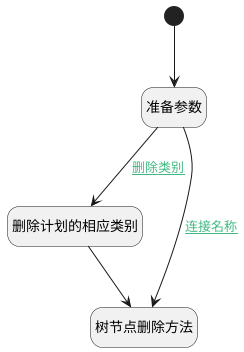

## 删除类别或分组 <!-- {docsify-ignore-all} -->

   调用树节点删除方法，删除当前树节点数据

### 处理过程




### 处理步骤说明

#### 开始 :id=Begin<sup class="footnote-symbol"> <font color=gray size=1>[开始]</font></sup>


#### 准备参数 :id=PREPAREJSPARAM1<sup class="footnote-symbol"> <font color=gray size=1>[准备参数]</font></sup>


1. 将`Default(传入变量)._id` 绑定给  `node_param(节点参数)`
2. 将`Default(传入变量)._deData` 绑定给  `node_data(节点数据)`

#### 树节点删除方法 :id=VIEWCTRLINVOKE1<sup class="footnote-symbol"> <font color=gray size=1>[视图部件调用]</font></sup>


调用`treeexpbar_tree(树部件)`的方法`removeTreeNode`，参数为`node_param(节点参数)`
#### 删除计划的相应类别 :id=DEACTION1<sup class="footnote-symbol"> <font color=gray size=1>[实体行为]</font></sup>


调用实体 [客户(CUSTOMER)](module/ProdMgmt/customer.md) 行为 [删除类别(delete_categories)](module/ProdMgmt/customer#行为) ，行为参数为`node_data(节点数据)`

### 连接条件说明
#### 删除类别 :id=PREPAREJSPARAM1-DEACTION1

(```Default(传入变量)._nodeId``` EQ ```node_3``` OR ```Default(传入变量)._nodeId``` EQ ```node_2```)
#### 连接名称 :id=PREPAREJSPARAM1-VIEWCTRLINVOKE1

```Default(传入变量)._nodeId``` EQ ```node_1```


### 实体逻辑参数

|    中文名   |    代码名    |  数据类型      |备注 |
| --------| --------| --------  | --------   |
|传入变量(<i class="fa fa-check"/></i>)|Default|数据对象||
|节点参数|node_param|简单数据||
|当前视图|view|当前视图对象||
|节点数据|node_data|数据对象||
|树部件|treeexpbar_tree|部件对象||
