## 选择下拉框区域展示 <!-- {docsify-ignore-all} -->

   逻辑控制关联表格下方选项区域动态显示

### 处理过程

```plantuml
@startuml
hide footbox
<style>
root {
  HyperlinkColor #42b983
}
</style>

hide empty description
state "开始" as Begin <<start>> [[$./show_choose_area#begin {开始}]]
state "设置选择区域显示" as PREPAREJSPARAM2  [[$./show_choose_area#preparejsparam2 {设置选择区域显示}]]
state "绑定部件对象" as PREPAREJSPARAM1  [[$./show_choose_area#preparejsparam1 {绑定部件对象}]]


Begin --> PREPAREJSPARAM1
PREPAREJSPARAM1 --> PREPAREJSPARAM2


@enduml
```

### 处理步骤说明

#### 开始 :id=Begin [开始]

#### 绑定部件对象 :id=PREPAREJSPARAM1 [准备参数]

1. 将`view(当前视图).layoutPanel.panelItems.choose_data.state` 设置给  `choose_data_state_obj(选项框状态对象)`

#### 设置选择区域显示 :id=PREPAREJSPARAM2 [准备参数]

1. 将`true` 设置给  `choose_data_state_obj(选项框状态对象).visible`

### 实体逻辑参数

|    中文名   |    代码名    |  数据类型      |备注 |
| --------| --------| --------  | --------   |
|选项框状态对象|choose_data_state_obj|数据对象||
|传入变量(<i class="fa fa-check"/></i>)|Default|数据对象||
|当前视图|view|当前视图对象||
